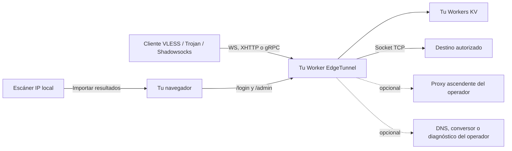

# Re_edgetunnel

<p align="center">
  Un túnel autogestionado para Cloudflare Workers con consola integrada, suscripciones nativas y exportación mediante IP preferida.
</p>

<p align="center">
  <a href="README.md">English</a> ·
  <a href="README.zh-CN.md">Chino simplificado</a> ·
  <a href="README.es.md">Español</a> ·
  <a href="README.fa.md">Persa</a>
</p>

<p align="center">
  
  
  
  
</p>

<p align="center">
  
</p>

Re_edgetunnel es un Worker modular que acepta VLESS y Trojan mediante WebSocket, XHTTP o gRPC, además de Shadowsocks SIP003 AEAD sobre WebSocket. Las conexiones TCP salientes usan la API Socket de Cloudflare. El mismo Worker incorpora una consola para administrar suscripciones, direcciones preferidas de Cloudflare, ajustes, registros, integraciones, copias de seguridad y recuperación.

La interfaz, sus estilos, scripts y generador QR forman parte del repositorio. En ejecución no se descarga un panel, una fuente, código o configuración desde otro repositorio o CDN. Las integraciones opcionales permanecen desactivadas hasta que el operador indique un endpoint propio.

> [!IMPORTANT]
> Utiliza este software únicamente con fines legales y en sistemas o redes para los que tengas autorización. El operador es responsable de las condiciones de Cloudflare, la normativa aplicable, la configuración del cliente y las políticas del destino.

## Resumen

| Área | Incluido |
| --- | --- |
| Protocolos de entrada | VLESS, Trojan y Shadowsocks SIP003 AEAD |
| Transportes | WebSocket, XHTTP `stream-one` y gRPC Hunk; Shadowsocks usa WebSocket |
| Salida | TCP mediante `cloudflare:sockets`, directo o por un proxy ascendente configurado por el operador |
| Exportación nativa | YAML de Mihomo/Clash y enlaces compartibles, sin conversor público |
| IP preferidas | Importación de resultados locales, almacenamiento en KV y URL persistentes con `ip`, `port` y `name` |
| Administración | Inicio de sesión, sesiones KV, resumen, nodos, ajustes, registros, integraciones, copia/restauración y cierre de sesión |
| Ascendentes opcionales | SOCKS5, HTTP CONNECT, HTTPS CONNECT, TURN/TURNS RFC 6062 y SSTP |
| No incluido | Escáner de la ruta del ISP, entrada QUIC/UDP nativa, Hysteria2, TUIC, WireGuard o VLESS Reality |

La consola integrada se muestra actualmente en chino simplificado. Las exportaciones y los protocolos son independientes del idioma; este repositorio incluye guías operativas en inglés, chino, español y persa.

## Arquitectura y límites de confianza



El plano de datos y la consola comparten Worker, pero usan rutas separadas. Abrir `/admin` no cambia el reenvío. Una exportación con IP preferida modifica únicamente la dirección con la que el cliente llega al borde de Cloudflare; no modifica la salida del Worker.

## Capturas

Las capturas proceden del código actual ejecutado localmente con un UUID sintético y direcciones reservadas para documentación. No contienen dominios de producción, identificadores de cuenta, tokens de suscripción reales ni contraseñas.

### Inicio de sesión

<p align="center">
  
</p>

### Biblioteca de IP preferidas

<p align="center">
  
</p>

### Generador de nodos y suscripciones

<p align="center">
  
</p>

## Requisitos

- Una cuenta de Cloudflare con Workers habilitado.
- Un namespace Workers KV dedicado al despliegue.
- Una versión LTS actual de Node.js, npm y Git.
- Un dominio personalizado en la misma cuenta si necesitas gRPC a nivel de zona.
- Un cliente compatible, por ejemplo Mihomo/Clash, para importar la configuración.

El proyecto utiliza `cloudflare:sockets`, por lo que su destino es Cloudflare Workers. No funciona sin cambios como Vercel Function ni como Vercel Edge Function.

## Despliegue completo

### 1. Clonar e instalar

```bash
git clone https://github.com/tianrking/Re_edgetunnel.git
cd Re_edgetunnel
npm ci
```

Para fijar Wrangler dentro del proyecto:

```bash
npm install --save-dev wrangler@latest
npx wrangler --version
```

### 2. Iniciar sesión en la cuenta correcta

```bash
npx wrangler login
npx wrangler whoami
```

Lee siempre el resultado de `whoami` antes de crear KV o desplegar. Así se evita publicar el Worker en otra cuenta que haya quedado iniciada.

### 3. Crear una configuración privada

El `wrangler.toml` versionado es una plantilla pública. Cópialo al nombre local ignorado por Git antes de añadir datos del despliegue:

```bash
cp wrangler.toml wrangler.local.toml
# PowerShell: Copy-Item wrangler.toml wrangler.local.toml
```

Puedes cambiar el `name` del Worker dentro de `wrangler.local.toml`. No confirmes ese archivo en Git.

### 4. Crear y enlazar KV

```bash
npx wrangler kv namespace create KV
```

Wrangler devuelve un ID. Sustituye el marcador solamente en `wrangler.local.toml`:

```toml
[[kv_namespaces]]
binding = "KV"
id = "paste-your-kv-namespace-id-here"
```

El nombre del binding debe seguir siendo `KV`. Usa namespaces distintos para pruebas y producción; compartir KV también comparte ajustes, listas, registros y sesiones activas.

### 5. Verificar y desplegar

```bash
npm run check
npm test
npx wrangler deploy --dry-run --config wrangler.local.toml
npx wrangler deploy --config wrangler.local.toml
```

Mientras no exista `ADMIN`, las peticiones HTTP normales responden deliberadamente `503 Administrator password is not configured.`

### 6. Guardar las credenciales como Secrets

Genera localmente una contraseña administrativa y un UUID v4 RFC 4122 independiente:

```bash
node -e "console.log(require('node:crypto').randomBytes(32).toString('base64url'))"
node -e "console.log(require('node:crypto').randomUUID())"
```

Introduce cada valor en el prompt interactivo de Wrangler:

```bash
npx wrangler secret put ADMIN --config wrangler.local.toml
npx wrangler secret put UUID --config wrangler.local.toml
npx wrangler secret list --config wrangler.local.toml
```

- `ADMIN` es la contraseña de `/login`.
- `UUID` es la credencial VLESS y la contraseña usada en los nodos Trojan y Shadowsocks generados.
- El `TOKEN` de suscripción no es la contraseña administrativa; se deriva del hostname activo y del UUID.

Usa valores distintos para `ADMIN` y `UUID`. Cambiar `ADMIN` no altera los nodos. Cambiar `UUID` invalida los nodos anteriores y cambia el token de suscripción.

### 7. Añadir un dominio personalizado

Añade la ruta únicamente a `wrangler.local.toml`:

```toml
routes = [
  { pattern = "tunnel.example.com", custom_domain = true }
]
```

Vuelve a desplegar:

```bash
npx wrangler deploy --config wrangler.local.toml
```

Para gRPC, habilita gRPC en los ajustes de red de la zona Cloudflare y conserva el hostname personalizado como SNI/servername del cliente. El hostname `workers.dev` y el dominio personalizado producen tokens de suscripción diferentes.

### 8. Abrir la consola

Visita:

```text
https://tunnel.example.com/login
```

Inicia sesión con `ADMIN`. La raíz muestra normalmente una página de camuflaje estilo nginx; es el comportamiento esperado.

## Primer uso

### Obtener una suscripción Clash nativa

Después de iniciar sesión:

1. Abre la sección de nodos y suscripciones.
2. Deja vacía la IP preferida para usar el hostname, o selecciona un resultado importado desde el escáner local.
3. Genera la vista previa.
4. Copia la URL actualizable o descarga el YAML de Mihomo/Clash.
5. Impórtalo y prueba la ruta desde la red real.

Endpoints nativos:

| Salida | URL |
| --- | --- |
| Lista URI sin codificar | `/sub?token=TOKEN` |
| Lista URI en Base64 | `/sub?token=TOKEN&base64` |
| YAML de Mihomo/Clash | `/sub?token=TOKEN&format=clash` |
| Texto con enlaces | `/sub?token=TOKEN&format=links` |
| Clash con dirección preferida | `/sub?token=TOKEN&format=clash&ip=IP` |
| Forzar descarga | Añadir `&download=1` |

Parámetros de dirección preferida:

| Parámetro | Significado |
| --- | --- |
| `ip` | IPv4 o IPv6 válida para la conexión |
| `port` | Puerto opcional entre `1` y `65535`; por defecto `443` |
| `name` | Etiqueta opcional, limitada y saneada por el Worker |

Trata cada URL de suscripción como una credencial. No la publiques en incidencias, capturas, analítica o conversores públicos.

### Usar una IP de Cloudflare medida localmente

El Worker no puede medir la ruta entre tu ISP y Cloudflare. Ejecuta el escáner en el dispositivo o red que usará el túnel e importa después los resultados en `/admin`.

Formatos admitidos, uno por línea:

```text
IP
IP:PUERTO
IP:PUERTO#ETIQUETA
IP:PUERTO#ETIQUETA,28ms
[IPv6]:PUERTO#ETIQUETA,42ms
```

Ejemplos reservados exclusivamente para documentación:

```text
198.51.100.42:443#Example-v4,28ms
[2001:db8::42]:443#Example-v6,42ms
```

Cuando se usa `ip`, Re_edgetunnel cambia únicamente `server` y el `port` opcional del nodo generado:

| Campo | Resultado |
| --- | --- |
| `server` / dirección de conexión | Se sustituye por la IP elegida |
| TLS `servername` / SNI | Conserva el hostname del Worker |
| `Host` de WebSocket | Conserva el hostname del Worker |
| `host` de XHTTP | Conserva el hostname del Worker |
| Nombre de servicio gRPC | Conserva la ruta del túnel sin la barra inicial |
| UUID, contraseña y ruta | Sin cambios |

Si se cambia `server`, SNI, Host y ruta a la misma IP, Cloudflare no podrá identificar correctamente el Worker. La IP es el objetivo de conexión al borde; el hostname sigue siendo la identidad TLS y de enrutamiento.

## Consola de administración

La consola genera un token de sesión aleatorio de 256 bits y guarda en KV una clave derivada con SHA-256. La cookie es `HttpOnly`, `Secure` y `SameSite=Strict`. La sesión caduca a las 24 horas; cerrar sesión la revoca inmediatamente.

| Sección | Función |
| --- | --- |
| Resumen | Estado de protocolos y transportes, host, ruta, credencial enmascarada, peticiones y número de IP preferidas |
| Nodos y suscripciones | Generación VLESS, Trojan y Shadowsocks, QR local, enlaces y YAML de Clash |
| IP preferidas | Importar, validar, deduplicar, guardar, elegir y borrar hasta 128 resultados IPv4/IPv6 |
| Ajustes | Nombre, ruta, transportes, huella, intervalo, certificados, 0-RTT y Shadowsocks |
| Registros | Lectura de registros KV después de retirar parámetros de consulta con credenciales |
| Integraciones y diagnóstico | Conversor, prueba de proxy, API de uso, DNS, ECH, Telegram y camuflaje configurados explícitamente |
| Seguridad | Copia sin secretos, restauración validada y restablecimiento de valores gestionados por la interfaz |

Rutas principales:

| Ruta | Método | Función |
| --- | --- | --- |
| `/login` | GET, POST | Crear sesión administrativa |
| `/admin` | GET | Cargar la consola integrada |
| `/admin/api/bootstrap` | GET | Modelo saneado de la consola y exportaciones nativas |
| `/admin/api/preview` | GET | Vista previa para el hostname o una IP preferida |
| `/admin/api/settings` | POST | Guardar ajustes de la interfaz sin eliminar otros valores |
| `/admin/api/preferred-ips` | POST | Importar y guardar resultados locales |
| `/admin/api/backup` | GET | Exportar ajustes e IP sin ADMIN, UUID, token ni secretos de integraciones |
| `/admin/api/restore` | POST | Restaurar una copia validada |
| `/admin/config.json` | GET, POST | Administración avanzada y compatibilidad con el esquema anterior |
| `/admin/ADD.txt` | GET, POST | Leer o reemplazar la lista de direcciones del operador |
| `/admin/log.json` | GET | Leer registros de acceso |
| `/admin/init` | POST | Restablecer `config.json` sin borrar listas ni registros |
| `/admin/check` | GET | Probar un ascendente SOCKS5/HTTP configurado explícitamente |
| `/logout` | GET | Revocar la sesión actual |

Los POST que modifican datos requieren un encabezado `Origin` o `Referer` del mismo origen como protección CSRF.

## Variables de ejecución

Guarda los datos sensibles en Cloudflare Secrets. Los valores no sensibles que varían por despliegue pueden ir en el archivo ignorado `wrangler.local.toml`.

| Variable | Almacenamiento recomendado | Uso |
| --- | --- | --- |
| `ADMIN` | Secret, obligatorio | Contraseña administrativa |
| `UUID` | Secret, muy recomendado | UUID v4 canónico de los nodos generados |
| `KEY` | Secret, opcional | Ruta privada adicional y clave heredada |
| `HOST` | Variable, opcional | Sobrescribe la lista de hosts generados |
| `PATH` | Variable, opcional | Ruta del túnel; por defecto `/tunnel` |
| `URL` | Variable, opcional | Camuflaje raíz: `nginx`, `1101` u origen HTTPS explícito |
| `PROXYIP` | Variable o Secret | IP de respaldo elegida por el operador |
| `UPSTREAM_PROXY` | Secret si contiene credenciales | Ascendente `socks5://`, `http://`, `https://`, `turn://`, `turns://` o `sstp://` |
| `TCP_CONCURRENT_DIAL` | Variable | Ancho de carrera directa, limitado a `1`-`4` |
| `PROXY_CONCURRENT_DIAL` | Variable | Ancho de carrera proxy, limitado a `1`-`4` |
| `SPEEDTEST_MODE` | Variable | `local` responde HTTP 204 local con límites; `block` cierra el túnel de prueba |
| `SPEEDTEST_DOMAINS` | Variable | Dominios manejados por la prueba local de conectividad |
| `DNS_RESOLVER` / `DNS_RESOLVER_PORT` | Variable | DNS TCP propio para el reenvío compatible y la resolución TURN/SSTP |
| `PROXY_CHECK_HOST` / `PORT` / `PATH` | Variable | Endpoint HTTP propio para diagnóstico del proxy |
| `LOCATIONS_API` | Variable | Endpoint HTTPS propio de datos de ubicación |
| `ECH_DOH_URL` | Variable | DoH HTTPS explícito usado únicamente con ECH |
| `ALLOW_REMOTE_USAGE_API` | Variable | Debe ser `true` antes de llamar a una API remota de uso guardada |

Los alias heredados `PASSWORD` y `TOKEN` siguen aceptándose para despliegues antiguos; usa `ADMIN` en instalaciones nuevas. No confirmes credenciales, ID de cuenta Cloudflare, ID de KV, dominios privados ni URL de suscripción generadas.

## Conversión opcional de suscripciones

Las salidas nativas `format=clash` y `format=links` no necesitan conversor. Los formatos heredados solo se habilitan al configurar un conversor HTTPS y una URL de configuración propios:

| Petición | Requisito externo |
| --- | --- |
| `?clash` | `SUBAPI` y `SUBCONFIG` propios |
| `?singbox` | `SUBAPI` y `SUBCONFIG` propios |
| `?surge` | `SUBAPI` y `SUBCONFIG` propios |
| `?quanx` | `SUBAPI` y `SUBCONFIG` propios |
| `?loon` | `SUBAPI` y `SUBCONFIG` propios |

Sin esos valores el Worker responde HTTP 501; no envía silenciosamente la suscripción a un servicio público.

## Worker Clash independiente, opcional

`workers/clash-sub` es otro Worker protegido por contraseña que publica una suscripción Clash para un hostname EdgeTunnel. Tiene una plantilla Wrangler genérica y necesita tres Secrets:

- `SECRET_TOKEN`
- `PAGE_PASSWORD`
- `CLOUDFLARE_UUID`

También requiere `CLOUDFLARE_HOST`, y su UUID debe coincidir con el Worker principal. Consulta [workers/clash-sub/README.md](workers/clash-sub/README.md). No copies un archivo personal de despliegue al repositorio.

## Límites de protocolo

Compatible:

- VLESS sobre WebSocket, XHTTP `stream-one` y gRPC Hunk.
- Trojan sobre WebSocket, XHTTP en la ruta del Worker y gRPC Hunk; la exportación Clash nativa emite las combinaciones que el cliente puede describir con seguridad.
- Shadowsocks `aes-128-gcm` y `aes-256-gcm` sobre WebSocket con framing SIP003 AEAD.
- Destinos TCP accesibles por la API Socket de Cloudflare.
- DNS VLESS/Trojan cuando existe un DNS TCP propio.
- SOCKS5, HTTP(S) CONNECT, TURN(S) RFC 6062 y SSTP como rutas ascendentes.

No compatible:

- Hysteria2 o TUIC, porque necesitan QUIC/UDP nativo.
- Entrada WireGuard.
- VLESS Reality, porque Cloudflare termina TLS.
- UDP arbitrario; el caso UDP implementado es DNS VLESS/Trojan configurado.
- Listener TCP nativo o proxy HTTP directo de propósito general.

TURN se limita a asignación TCP y conexión vinculada RFC 6062. SSTP se limita a TLS, PPP PAP/IPCP, IPv4 y TCP interno; no declara compatibilidad con MPPE, IPv6CP ni extensiones de proveedor.

## Seguridad antes de publicar

Antes de cada commit público:

- Mantén `wrangler.local.toml`, `.dev.vars` y `.wrangler/` fuera de Git.
- Guarda `ADMIN`, `UUID`, credenciales de proxy, tokens API y credenciales del Worker complementario como Secrets.
- Usa rangos reservados como `198.51.100.0/24` y `2001:db8::/32` en ejemplos.
- Obtén capturas de un despliegue local sintético, nunca de producción.
- Revisa tanto el árbol actual como todo el historial Git alcanzable: borrar un secreto en un commit posterior no lo elimina de commits anteriores.
- Rota cualquier credencial que haya entrado en Git, aunque se reescriba el historial.

Los registros eliminan parámetros de consulta habituales que contienen credenciales. Las copias de seguridad omiten `ADMIN`, UUID, token de suscripción, sesiones y secretos de integraciones. Estas medidas reducen errores, pero una URL de suscripción pública sigue siendo insegura.

## Actualización y reversión

```bash
git pull --ff-only
npm ci
npm run check
npm test
npx wrangler deploy --dry-run --config wrangler.local.toml
npx wrangler deploy --config wrangler.local.toml
```

Versiones de Cloudflare:

```bash
npx wrangler versions list --config wrangler.local.toml
npx wrangler rollback --config wrangler.local.toml
```

Exporta una copia desde la consola antes de cambiar datos almacenados. Revertir código no revierte automáticamente KV.

## Solución de problemas

### La raíz muestra "Welcome to nginx"

Es el camuflaje predeterminado. Abre `/login`.

### `503 Administrator password is not configured`

```bash
npx wrangler secret put ADMIN --config wrangler.local.toml
```

### Error de binding KV

Comprueba que el ID exista, que el binding se llame exactamente `KV` y que Wrangler use la cuenta propietaria del namespace.

### `403 Invalid Token`

Copia de nuevo la suscripción desde el mismo hostname. `workers.dev` y el dominio personalizado tienen tokens distintos; el token también cambia al rotar UUID.

### `/admin` vuelve al login

Inicia sesión otra vez, revisa KV y confirma que otra extensión o proxy no bloquee `/assets/edgetunnel-ui.css` ni `/assets/edgetunnel-admin.js`.

### gRPC no conecta

Usa un dominio personalizado, habilita gRPC en la zona y conserva ese hostname como SNI/servername. No sustituyas SNI por la IP preferida.

### WebSocket conecta, pero el destino no responde

Revisa UUID/contraseña, SNI, Host, ruta, puerto de destino, restricciones salientes y registros:

```bash
npx wrangler tail --config wrangler.local.toml
```

### La conversión heredada responde 501

Configura `SUBAPI` y `SUBCONFIG` propios, o usa `format=clash` / `format=links`.

## Desarrollo y pruebas

```bash
npm run check
npm test
```

Pruebas opcionales contra un entorno Cloudflare dedicado:

```bash
npm run test:cloudflare:http
npm run test:cloudflare
```

No ejecutes pruebas externas con credenciales o KV de producción.

Estructura:

```text
src/
├── index.js                  Entrada del Worker y enrutamiento
├── config.js                 Configuración, KV, enlaces derivados y registros
├── controllers/              Autenticación, API administrativa y suscripciones
├── core/                     Ciclo Socket, marcado, túneles HTTP y pruebas
├── protocols/                Parsers y adaptadores ascendentes
├── subscriptions/native.js  Clash/enlaces nativos y sustitución de IP
├── ui/                       Páginas, estilos, scripts y QR autogestionados
└── utils/                    Entrada, seguridad, páginas y diagnóstico

workers/clash-sub/            Worker opcional de suscripción Clash
test/                         Suite de pruebas Node
scripts/                      Verificación en Cloudflare dedicado
docs/images/                  Capturas saneadas de documentación
```

## Créditos

Re_edgetunnel parte de ideas de [cmliu/edgetunnel](https://github.com/cmliu/edgetunnel) y [zizifn/edgetunnel](https://github.com/zizifn/edgetunnel). El código mantenido aquí está modularizado y no descarga esos repositorios durante la ejecución.

## Licencia

Consulta [LICENSE](LICENSE). No se ofrece garantía. El operador es responsable de la seguridad del despliegue, el uso legal y el tráfico procesado por su Worker.
