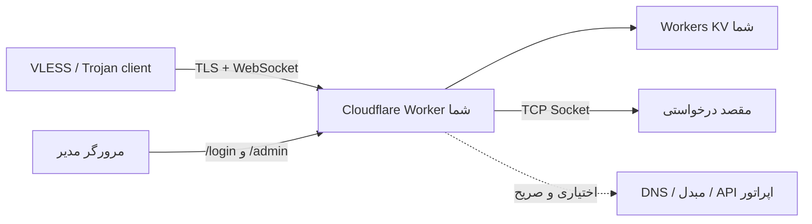

# EdgeTunnel

<p align="center" dir="rtl">
  تونل ماژولار VLESS، Trojan و Shadowsocks برای Cloudflare Workers، تحت کنترل کامل اپراتور.
</p>

<p align="center">
  <a href="README.md">انگلیسی</a> ·
  <a href="README.zh-CN.md">چینی ساده‌شده</a> ·
  <a href="README.es.md">اسپانیایی</a> ·
  <a href="README.fa.md">فارسی</a>
</p>

<p align="center">
  
  
  
</p>

> [!IMPORTANT]
> EdgeTunnel برای پژوهش، آموزش و دسترسی قانونی به سامانه‌هایی طراحی شده است که اجازهٔ استفاده از آن‌ها را دارید. رعایت قوانین، شرایط Cloudflare و سیاست‌های شبکه بر عهدهٔ کاربر است.

## این پروژه چیست؟

EdgeTunnel یک Cloudflare Worker ماژولار است. این Worker **VLESS و Trojan روی WebSocket، XHTTP یا gRPC** و نیز **Shadowsocks SIP003 AEAD روی WebSocket** را دریافت می‌کند و با Socket API کلادفلر، مستقیم یا از راه پراکسی بالادستی صریح، اتصال TCP خروجی می‌سازد.

در زمان اجرا هیچ کد، پنل مدیریت یا تنظیماتی از مخزن GitHub یا CDN دیگر بارگیری نمی‌شود. سرویس‌های راه‌دور تا زمانی که مدیر نشانی سرویس تحت کنترل خود را وارد نکند غیرفعال می‌مانند.

### وضعیت فعلی

| بخش | وضعیت |
| --- | --- |
| VLESS روی WebSocket/TLS | پشتیبانی می‌شود |
| Trojan روی WebSocket/TLS | پشتیبانی می‌شود |
| VLESS/Trojan روی XHTTP `stream-one` | پشتیبانی می‌شود؛ جریان محدود دوطرفه |
| VLESS/Trojan روی gRPC Hunk | پشتیبانی از فریم تکه‌تکه و ترکیبی |
| Shadowsocks `aes-128-gcm` / `aes-256-gcm` | پشتیبانی روی WebSocket با SIP003 AEAD |
| DNS مبتنی بر UDP در Trojan | با DNS مبتنی بر TCP متعلق به اپراتور |
| TCP خروجی با Cloudflare Sockets | پشتیبانی می‌شود |
| پراکسی بالادستی SOCKS5، HTTP و HTTPS | پشتیبانی می‌شود |
| TURN/TURNS RFC 6062 | برای اتصال TCP پیاده‌سازی شده |
| SSTP | برای TLS، PPP PAP/IPCP و TCP داخلی IPv4 پیاده‌سازی شده |
| ورود با رمز، نشست KV و خروج | پشتیبانی می‌شود |
| اشتراک محافظت‌شده با token | پشتیبانی می‌شود |
| اشتراک بر پایهٔ فهرست آدرس محلی | پشتیبانی می‌شود |
| رقابت محدود اتصال مستقیم و پراکسی | پشتیبانی می‌شود؛ برای هر درخواست، `1` تا `4` اتصال |
| پاسخ محلی HTTP 204 برای آزمون اتصال | پشتیبانی می‌شود؛ بدون ترافیک آزمون خروجی |
| تبدیل Mihomo/Clash، Sing-box و Surge | اختیاری؛ نیازمند مبدل تحت کنترل اپراتور |
| پنل گرافیکی مدیریت داخلی | پشتیبانی می‌شود؛ نمای کلی، نودها، IP برگزیده، تنظیمات، گزارش، یکپارچه‌سازی، پشتیبان و امنیت |
| خروجی بومی Mihomo/Clash و پیوندهای اشتراک | پشتیبانی می‌شود؛ بدون مبدل و با جایگزینی اختیاری IP برگزیده |
| Hysteria2، TUIC و پروتکل‌های بومی QUIC/UDP | در این معماری پشتیبانی نمی‌شوند |

> [!NOTE]
> مسیر `/admin` یک برنامهٔ مدیریت کامل و بسته‌بندی‌شده در Worker است. این صفحه پنل، اسکریپت، فونت، سرویس QR یا تنظیمات را از میزبان شخص ثالث بارگیری نمی‌کند. مسیر دادهٔ تونل و مسیرهای اشتراک قبلی از رابط کاربری مستقل‌اند.

## معماری و مرز اعتماد



وابستگی‌های الزامی:

- Cloudflare Workers.
- یک Workers KV با نام اتصال دقیق `KV`.

یکپارچه‌سازی‌های اختیاری که به‌طور پیش‌فرض خاموش‌اند:

- DNS متعلق به اپراتور برای انتقال DNS در VLESS.
- مبدل اشتراک و فایل تنظیمات متعلق به اپراتور.
- مقصد بررسی پراکسی متعلق به اپراتور.
- API اطلاعات موقعیت متعلق به اپراتور.
- DoH مبتنی بر HTTPS که هنگام فعال‌سازی ECH صریحاً انتخاب شود.
- اعلان Telegram، سایت پوششی راه‌دور یا API مصرف Cloudflare.

## پیش‌نیازها

- حساب Cloudflare با Workers فعال.
- Node.js و npm.
- Git.
- ترمینال.

Cloudflare نصب Wrangler در داخل هر پروژه را توصیه می‌کند. فرمان‌های زیر از `npx` استفاده می‌کنند تا نسخهٔ محلی پروژه اجرا شود.

## راهنمای کامل استقرار

### ۱. دریافت مخزن

```bash
git clone https://github.com/tianrking/Re_edgetunnel.git
cd Re_edgetunnel
```

### ۲. نصب محلی Wrangler

```bash
npm install --save-dev wrangler@latest
npx wrangler --version
```

Wrangler نسخهٔ 4.x یا جدیدتر توصیه می‌شود.

### ۳. ورود به Cloudflare

```bash
npx wrangler login
npx wrangler whoami
```

فرمان اول صفحهٔ تأیید مرورگر را باز می‌کند و فرمان دوم حساب فعال را نشان می‌دهد.

### ۴. ساخت و اتصال KV اختصاصی

```bash
npx wrangler kv namespace create KV
```

Wrangler یک شناسه چاپ می‌کند. مقدار نمونه را در `wrangler.toml` جایگزین کنید:

```toml
[[kv_namespaces]]
binding = "KV"
id = "شناسه-KV-را-اینجا-قرار-دهید"
```

نام `binding` باید دقیقاً `KV` باقی بماند، زیرا برنامه از `env.KV` استفاده می‌کند.

برای آزمایش و تولید KV جداگانه بسازید. استفاده از KV مشترک به معنی اشتراک تنظیمات، نشست‌ها، فهرست آدرس و گزارش‌هاست.

### ۵. اعتبارسنجی و ساخت Worker

```bash
npm test
npm run check
npx wrangler deploy --dry-run
npx wrangler deploy
```

استقرار اول Worker را ایجاد می‌کند. تا پیش از تعریف `ADMIN`، پاسخ `503 Administrator password is not configured.` عمدی است و نشانهٔ خرابی نیست.

### ۶. ذخیرهٔ رمز مدیریت به‌صورت Secret

برای تولید مقدار قوی در دستگاه خود:

```bash
node -e "console.log(require('node:crypto').randomBytes(32).toString('base64url'))"
```

آن را تعاملی ذخیره کنید:

```bash
npx wrangler secret put ADMIN
```

مقدار واقعی را در کد یا `wrangler.toml` ننویسید. Wrangler مقدار را در prompt دریافت و نسخهٔ جدید Worker را فوراً مستقر می‌کند.

### ۷. ذخیرهٔ UUID نسخهٔ ۴ مستقل

UUID شناسهٔ VLESS و رمز Trojan است:

```bash
node -e "console.log(require('node:crypto').randomUUID())"
npx wrangler secret put UUID
```

مقادیر `ADMIN` و `UUID` باید متفاوت باشند. تغییر UUID تمام لینک‌ها و اشتراک‌های قدیمی را نامعتبر می‌کند.

نام Secretها را بررسی کنید:

```bash
npx wrangler secret list
```

Cloudflare فقط نام Secretها را نمایش می‌دهد، نه مقدارشان را.

### ۸. باز کردن Worker

Wrangler نشانی مشابه زیر نمایش می‌دهد:

```text
https://edgetunnel.<workers-subdomain>.workers.dev
```

صفحهٔ اصلی معمولاً نمای پوششی nginx را نشان می‌دهد و این طبیعی است. برای ورود، نشانی زیر را باز کنید:

```text
https://edgetunnel.<workers-subdomain>.workers.dev/login
```

با مقدار `ADMIN` وارد شوید و سپس `/admin` را باز کنید.

## نخستین استفاده: نود و اشتراک

### دریافت نود و اشتراک از پنل

1. وارد شوید و `/admin` را باز کنید.
2. بخش نودها و اشتراک‌ها را باز کنید.
3. URI مربوط به VLESS، Trojan یا Shadowsocks را کپی کنید، QR داخلی را نمایش دهید یا YAML بومی Mihomo/Clash را دریافت کنید.
4. نتیجه را در کلاینت سازگار وارد کنید.

پنل بر پایهٔ انتقال‌های فعال، ورودی‌های WebSocket، XHTTP و gRPC می‌سازد. اعتبارنامه به‌صورت فیلد مستقل نمایش داده نمی‌شود، اما ناگزیر در URI کپی‌شده و خروجی اشتراک محافظت‌شده وجود دارد.

### ساخت نشانی اشتراک

پنل نشانی‌های بومی آمادهٔ کپی را نمایش می‌دهد. برای سازگاری با ابزارهای قدیمی، ویژگی یکتای `TOKEN` پس از ورود همچنان در `/admin/config.json` در دسترس است:

```text
https://WORKER_HOST/sub?token=TOKEN
```

نشانی اشتراک یک اطلاعات محرمانه است. آن را عمومی نکنید، در تصویر قرار ندهید و به Git نفرستید.

### قالب‌های خروجی اشتراک

| خروجی | پسوند URL | نیازمندی |
| --- | --- | --- |
| فهرست خام URI در مرورگر | `/sub?token=TOKEN` | بدون سرویس بیرونی |
| اشتراک Base64 | `/sub?token=TOKEN&base64` | بدون سرویس بیرونی |
| YAML بومی Mihomo/Clash | `/sub?token=TOKEN&format=clash` | بدون سرویس بیرونی |
| متن بومی پیوندها | `/sub?token=TOKEN&format=links` | بدون سرویس بیرونی |
| Clash بومی با IP برگزیده | `/sub?token=TOKEN&format=clash&ip=104.18.35.249` | IPv4 یا IPv6 کلادفلر که محلی آزموده شده است |
| Mihomo/Clash تبدیل‌شدهٔ قدیمی | `/sub?token=TOKEN&clash` | `SUBAPI` و `SUBCONFIG` تحت کنترل اپراتور |
| Sing-box JSON | `/sub?token=TOKEN&singbox` | `SUBAPI` و `SUBCONFIG` تحت کنترل اپراتور |
| Surge | `/sub?token=TOKEN&surge` | `SUBAPI` و `SUBCONFIG` تحت کنترل اپراتور |
| Quantumult X | `/sub?token=TOKEN&quanx` | `SUBAPI` و `SUBCONFIG` تحت کنترل اپراتور |
| Loon | `/sub?token=TOKEN&loon` | `SUBAPI` و `SUBCONFIG` تحت کنترل اپراتور |

پارامترهای اختیاری خروجی بومی `ip`، `port`، `name` و `download=1` هستند. IP برگزیده فقط `server` اتصال و در صورت تعیین، پورت را عوض می‌کند؛ `servername` یا SNI در TLS، مقدار `Host`، مسیر تونل و اعتبارنامه همچنان به دامنهٔ Worker اشاره می‌کنند. پنل IPv4 و IPv6 را اعتبارسنجی و حداکثر ۱۲۸ نتیجهٔ اسکن محلی را در KV همان استقرار نگهداری می‌کند.

Worker نمی‌تواند مسیر شبکهٔ محلی کاربر را اندازه‌گیری کند. اسکن تأخیر را در شبکهٔ کلاینت اجرا، نتیجه را وارد و نود ساخته‌شده را در کلاینت واقعی آزمایش کنید. درخواست تبدیل قدیمی بدون مبدل اپراتور پاسخ HTTP 501 می‌دهد؛ خروجی‌های `format=clash` و `format=links` به مبدل نیاز ندارند.

### ویندوز: گزینش نشانی کم‌تأخیر با HTTPing در CloudflareSpeedTest

ابزار متن‌باز و مستقل [XIU2/CloudflareSpeedTest](https://github.com/XIU2/CloudflareSpeedTest) می‌تواند تأخیر HTTP میان شبکهٔ فعلی و نشانی‌های لبهٔ Cloudflare را اندازه بگیرد. Re_edgetunnel این اسکنر را همراه خود ندارد، میزبانی نمی‌کند و از راه دور اجرا نمی‌کند. نسخهٔ مناسب سیستم‌عامل و معماری خود را از [Releases رسمی](https://github.com/XIU2/CloudflareSpeedTest/releases) دریافت کنید.

فرمان PowerShell زیر را در پوشه‌ای اجرا کنید که `cfst.exe` و `ip.txt` در آن قرار دارند. نام میزبان نمونه را با دامنهٔ Worker خود عوض کنید و فقط نشانی عمومی ریشهٔ HTTPS را به کار ببرید. Token اشتراک، مسیر مدیریت یا هر اعتبارنامهٔ دیگری را در `-url` قرار ندهید.

```powershell
.\cfst.exe -f ip.txt -tp 443 -httping -url https://worker.example.com/ -n 50 -p 30 -dd -o result-httping.csv
```

| گزینه | کاربرد در این نمونه |
| --- | --- |
| `-f ip.txt` | نشانی‌های IP یا بازه‌های CIDR کلادفلر را از `ip.txt` می‌خواند |
| `-tp 443` | درگاه رایج HTTPS یعنی `443` را آزمایش می‌کند |
| `-httping` | به‌جای TCPing پیش‌فرض، تأخیر را با درخواست HTTP/HTTPS به `-url` می‌سنجد |
| `-url https://worker.example.com/` | با دامنهٔ Worker، TLS، وضعیت HTTP و مسیریابی Cloudflare را بررسی می‌کند |
| `-n 50` | از ۵۰ کارگر هم‌زمان برای سنجش تأخیر استفاده می‌کند؛ این عدد شمار IPهای نمایشی نیست |
| `-p 30` | ۳۰ نتیجهٔ نخستِ مرتب‌شده را در ترمینال نشان می‌دهد |
| `-dd` | آزمون دانلود را غیرفعال و نتیجه را بر پایهٔ میانگین تأخیر مرتب می‌کند |
| `-o result-httping.csv` | نتیجهٔ کامل را در فایل CSV پوشهٔ فعلی می‌نویسد |

شمار نشانی‌های قابل دسترس فقط یعنی HTTPing بدون پایان مهلت اجرا شده و کد وضعیت پذیرفته‌شده گرفته است؛ همهٔ آن نشانی‌ها الزاماً مناسب نیستند. نتیجه‌ای با نرخ ازدست‌رفتن بستهٔ `0.00`، میانگین تأخیر کمتر و تکرارپذیری بهتر را در اولویت بگذارید. چون فرمان دارای `-dd` است، نمایش سرعت دانلود `0.00 MB/s` طبیعی است و شکست سنجش تأخیر محسوب نمی‌شود.

برای حذف هر نتیجه‌ای که حتی اندکی اتلاف بسته دارد، `-tlr 0` را اضافه کنید. برای محدودکردن نتیجه به چند مکان Cloudflare می‌توان فیلتری مانند `-cfcolo SIN,HKG,NRT` افزود. HTTPing همچنان نوعی اسکن شبکه است؛ هم‌زمانی را متعادل نگه دارید و آن را با بسامد بالا تکرار نکنید. هنگام آزمایش، پراکسی سیستم را خاموش یا CFST را از آن مستثنا کنید تا نتیجه مسیر واقعی کلاینت را نشان دهد.

فایل `result-httping.csv` خروجی خام CFST است. کادر ورود فعلی پنل، به‌جای کل CSV، در هر خط یک نشانی نرمال‌شده می‌پذیرد. ردیف‌های مناسب را انتخاب، مانند نمونهٔ زیر تبدیل و در صفحهٔ IPهای برگزیدهٔ `/admin` وارد کنید:

```text
CFST CSV:     104.18.46.92,4,4,0.00,54.65,0.00,SIN
Panel line:   104.18.46.92:443#SIN,54.65ms
```

نشانی بالا فقط روش تبدیل فیلدها را نشان می‌دهد و توصیه‌ای همگانی نیست. پس از ورود، پیوند Clash یا اشتراک را بسازید و اتصال، گذردهی و پایداری ساعت‌های شلوغ را در کلاینت واقعی دوباره آزمایش کنید. یک رتبه‌بندی HTTPing جای آزمون سرتاسری تونل را نمی‌گیرد.

## پنل مدیریت

مسیرهای مدیریت به نشست معتبر ذخیره‌شده در KV نیاز دارند. نشست پس از ۲۴ ساعت منقضی و با خروج فوراً باطل می‌شود.

| مسیر | روش | کاربرد |
| --- | --- | --- |
| `/login` | GET, POST | فرم ورود محلی و ایجاد نشست |
| `/admin` | GET | پنل داخلی سازگار با دسکتاپ و موبایل |
| `/admin/api/bootstrap` | GET | وضعیت پاک‌سازی‌شده، خروجی بومی، IPهای برگزیده و گزارش اخیر |
| `/admin/api/preview` | GET | پیش‌نمایش با دامنهٔ سرویس یا IP برگزیدهٔ معتبر |
| `/admin/api/settings` | POST | ذخیرهٔ تنظیمات تحت مدیریت رابط و حفظ تنظیمات دیگر |
| `/admin/api/preferred-ips` | POST | ورود، اعتبارسنجی، حذف تکرار و ذخیرهٔ IPv4/IPv6 |
| `/admin/api/backup` | GET | خروجی تنظیمات و IPها بدون رمز مدیر، UUID، token یا راز یکپارچه‌سازی |
| `/admin/api/restore` | POST | بازیابی پشتیبان اعتبارسنجی‌شدهٔ پنل |
| `/admin/config.json` | GET | تنظیمات مؤثر، `LINK` و token اشتراک |
| `/admin/config.json` | POST | ذخیرهٔ کل JSON در KV |
| `/admin/ADD.txt` | GET | خواندن فهرست ذخیره‌شده یا فهرست محلی تولیدشده |
| `/admin/ADD.txt` | POST | ذخیرهٔ فهرست آدرس اپراتور |
| `/admin/log.json` | GET | مشاهدهٔ گزارش درخواست‌ها |
| `/admin/init` | POST | بازنشانی `config.json`؛ آدرس‌ها و گزارش‌ها حذف نمی‌شوند |
| `/admin/check` | GET | آزمایش پراکسی بالادستی با مقصد متعلق به اپراتور |
| `/logout` | GET | باطل کردن نشست و پاک کردن Cookie |

درخواست‌های POST تغییردهنده باید `Origin` یا `Referer` هم‌مبدأ داشته باشند. این محدودیت برای جلوگیری از CSRF است.

### ویرایش تنظیمات در مرورگر

برای استفادهٔ روزمره از بخش تنظیمات `/admin` کمک بگیرید. نام، مسیر، انتقال‌ها، اثرانگشت TLS، فاصلهٔ به‌روزرسانی، Shadowsocks، ‏0-RTT و اعتبارسنجی گواهی در آن مدیریت می‌شوند. پشتیبان شامل رازها نیست و بازنشانی پنل، تنظیمات خارج از کنترل رابط، IPهای برگزیده، `ADMIN` و `UUID` را حفظ می‌کند.

رابط JSON زیر برای مدیریت پیشرفته و سازگاری قبلی باقی مانده است.

ساختار JSON ذخیره‌شده برای سازگاری با نسخه‌های قبلی، نام‌های داخلی قدیمی را حفظ می‌کند. برای آنکه این راهنما کاملاً فارسی بماند و نیازی به نوشتن آن نام‌ها نباشد، نمونهٔ زیر شیء اشتراک را از روی ویژگی‌های ثابت ASCII پیدا می‌کند.

پس از ورود، `/admin` و کنسول توسعه‌دهندهٔ مرورگر را باز کنید:

```js
const config = await fetch('/admin/config.json').then((response) => response.json());

const subscription = Object.values(config).find((value) =>
  value && typeof value === 'object' &&
  typeof value.TOKEN === 'string' &&
  typeof value.SUBNAME === 'string'
);

if (!subscription) throw new Error('تنظیمات اشتراک پیدا نشد');

// نمونه: تغییر نام نمایشی بدون وابستگی به کلیدهای بومی‌شده
subscription.SUBNAME = 'edgetunnel-من';

const response = await fetch('/admin/config.json', {
  method: 'POST',
  headers: { 'Content-Type': 'application/json' },
  body: JSON.stringify(config),
});

console.log(response.status, await response.text());
```

پاسخ موفق `{"success":true}` است. برای اطمینان `/admin/config.json` را دوباره بارگیری کنید.

### ذخیرهٔ فهرست آدرس شخصی

قالب هر خط:

```text
hostname-or-ip:port#نام نمایشی
```

نمونه:

```text
example.com:443#اصلی
203.0.113.10:443#نمونه IPv4
[2001:db8::10]:443#نمونه IPv6
```

آدرس‌های بالا ویژهٔ مستندات‌اند؛ آن‌ها را با مقصدی که اجازهٔ استفاده از آن را دارید جایگزین کنید. خطوط نامعتبر و پورت خارج از `1-65535` نادیده گرفته می‌شوند.

```js
const addresses = `example.com:443#اصلی
203.0.113.10:443#پشتیبان`;

const response = await fetch('/admin/ADD.txt', {
  method: 'POST',
  headers: { 'Content-Type': 'text/plain; charset=utf-8' },
  body: addresses,
});

console.log(response.status, await response.text());
```

### بازنشانی تنظیمات اصلی

```js
const response = await fetch('/admin/init', { method: 'POST' });
console.log(response.status, await response.text());
```

این فرمان فقط `config.json` را بازنشانی می‌کند و `ADD.txt`، گزارش‌ها، نشست‌ها، Telegram یا تنظیمات مصرف Cloudflare را حذف نمی‌کند.

## تنظیمات مهم

| تنظیم | مقدار پیش‌فرض | معنی |
| --- | --- | --- |
| پروتکل نود تولیدی | `vless` | انتخاب لینک VLESS یا Trojan |
| انتقال | WebSocket | روش انتقال میان کلاینت و Worker |
| فهرست میزبان‌ها | دامنهٔ فعلی Worker | دامنه‌های مورد استفاده در اشتراک |
| صرف‌نظر از اعتبارسنجی گواهی | غیرفعال | اعتبارسنجی گواهی کلاینت را خاموش می‌کند؛ توصیه نمی‌شود |
| 0-RTT | غیرفعال | دادهٔ زودهنگام را به مسیر WebSocket می‌افزاید |
| حالت مسیر تصادفی | غیرفعال | هنگام فعال‌سازی برای نودهای محلی از `/` استفاده می‌کند |
| اثر انگشت TLS | `chrome` | راهنمای اثر انگشت TLS برای کلاینت |
| ECH | غیرفعال | فقط با DoH صریح HTTPS تنظیمات ECH تولید می‌کند |
| تولید محلی اشتراک | فعال | از فهرست آدرس ذخیره‌شده در KV استفاده می‌کند |
| نام اشتراک | `edgetunnel` | نام نمایشی که در `SUBNAME` ذخیره می‌شود |
| فاصلهٔ به‌روزرسانی | ۳ ساعت | فاصلهٔ پیشنهادی که در `SUBUpdateTime` ذخیره می‌شود |
| API مبدل | تنظیم نشده | نشانی پایهٔ متعلق به اپراتور در `SUBAPI` |
| تنظیمات مبدل | تنظیم نشده | نشانی HTTPS متعلق به اپراتور در `SUBCONFIG` |
| پایهٔ rule-set در Sing-box | تنظیم نشده | نشانی پایهٔ متعلق به اپراتور برای فایل‌های `.srs` |
| فهرست DNS کلاینت | خالی | DNSهایی که صریحاً به خروجی Clash افزوده می‌شوند |
| اعلان Telegram | غیرفعال | پس از ذخیرهٔ اعتبارنامه، اعلان درخواست می‌فرستد |

مقادیر `HOST`، `UUID`، `PATH`، `LINK`، `TOKEN`، زمان و مصرف در زمان اجرا محاسبه می‌شوند و ممکن است هنگام خواندن JSON دوباره نوشته شوند.

## متغیرهای استقرار

اطلاعات حساس را با `wrangler secret put` ذخیره کنید. گزینه‌های غیرحساس می‌توانند در `[vars]` فایل `wrangler.toml` قرار گیرند.

| متغیر | الزامی | کاربرد |
| --- | --- | --- |
| `ADMIN` | بله | رمز مدیریت؛ به‌صورت Secret |
| `UUID` | قویاً توصیه می‌شود | اعتبارنامهٔ RFC 4122 v4؛ به‌صورت Secret |
| `KEY` | خیر | ورودی محرمانهٔ اضافه و میان‌بر خصوصی اختیاری؛ Secret |
| `HOST` | خیر | دامنه‌های جداشده با ویرگول یا خط جدید |
| `URL` | خیر | پوشش مسیر اصلی: `nginx`، `1101` یا مبدأ HTTPS صریح |
| `PROXYIP` | خیر | پراکسی TCP پشتیبان انتخاب‌شده توسط اپراتور |
| `UPSTREAM_PROXY` | خیر | نشانی کامل `socks5://`، `http://`، `https://`، `turn://`، `turns://` یا `sstp://` |
| `UPSTREAM_PROXY_MODE` | خیر | `always` به‌عنوان پیش‌فرض یا مسیریابی انتخابی `cloudflare` |
| `TCP_CONCURRENT_DIAL` | خیر | تعداد رقابت اتصال مستقیم TCP، محدود به `1` تا `4`؛ پیش‌فرض `1` |
| `PROXY_CONCURRENT_DIAL` | خیر | تعداد رقابت نامزدهای پراکسی، محدود به `1` تا `4`؛ پیش‌فرض `1` |
| `SPEEDTEST_MODE` | خیر | `local` (پیش‌فرض) پاسخ HTTP 204 محلی و محدود می‌دهد؛ `block` تونل را می‌بندد |
| `SPEEDTEST_DOMAINS` | خیر | دامنه‌های آزمون محلی جداشده با ویرگول یا خط جدید؛ پیش‌فرض `speed.cloudflare.com` و `cp.cloudflare.com` |
| `DNS_RESOLVER` | خیر | DNS مبتنی بر TCP اپراتور برای VLESS/Trojan و مقصدهای TURN/SSTP |
| `DNS_RESOLVER_PORT` | خیر | پورت DNS؛ پیش‌فرض `53` |
| `PROXY_CHECK_HOST` | خیر | میزبان متعلق به اپراتور برای بررسی پراکسی |
| `PROXY_CHECK_PORT` | خیر | پورت بررسی؛ پیش‌فرض `80` |
| `PROXY_CHECK_PATH` | خیر | مسیر HTTP بررسی؛ پیش‌فرض `/` |
| `LOCATIONS_API` | خیر | API مکان مبتنی بر HTTPS و متعلق به اپراتور |
| `ECH_DOH_URL` | خیر | DoH صریح HTTPS فقط برای ECH |
| `ALLOW_REMOTE_USAGE_API` | خیر | باید `true` باشد تا API مصرف راه‌دور فراخوانی شود |

نبودن هر endpoint اختیاری، قابلیت مربوط را غیرفعال می‌کند. سرویس عمومی مخفی به‌عنوان جایگزین وجود ندارد.

### مسیریابی انتخابی مقصدهای Cloudflare

Cloudflare Workers سوکت TCP خروجی به بازه‌های IP متعلق به Cloudflare را مسدود می‌کند. با `UPSTREAM_PROXY_MODE=cloudflare`، مقصد IP به‌صورت محلی با فهرست رسمی تطبیق داده می‌شود؛ مقصد دامنه از طریق JSON DNS-over-HTTPS کلادفلر برای A و AAAA حل می‌شود و نتیجه بین ۳۰ ثانیه تا یک ساعت در حافظهٔ isolate ذخیره می‌گردد. فقط نتیجه‌های متعلق به Cloudflare از `UPSTREAM_PROXY` استفاده می‌کنند و بقیه مستقیم می‌مانند. اگر هر دو پرس‌وجوی DNS شکست بخورند، مسیر مستقیم حفظ می‌شود.

مقدار پیش‌فرض `always` رفتار تاریخی را حفظ می‌کند و همهٔ مقصدها را به بالادست می‌فرستد. `PROXYIP` همچنان یک پشتیبان مستقل است. نشانی بالادست دارای اعتبارنامه را فقط در Wrangler Secret نگه دارید. خود endpoint بالادست باید بیرون از بازه‌های Cloudflare resolve شود؛ از رکورد DNS-only یا نشانی مستقیم غیر Cloudflare استفاده کنید. snapshot داخلی از فهرست‌های رسمی [IPv4](https://www.cloudflare.com/ips-v4/) و [IPv6](https://www.cloudflare.com/ips-v6/) گرفته شده است. ترافیک TCP در هر دو جهت زمان‌سنج بیکاری ۱۵ دقیقه‌ای را تازه می‌کند و سقف جداگانهٔ یک‌ساعتهٔ نشست باقی می‌ماند.

تنظیمات اتصال برای هر درخواست جداگانه خوانده می‌شوند و به‌صورت وضعیت سراسری تغییرپذیر بین درخواست‌ها باقی نمی‌مانند. آزمون محلی هیچ سوکت خروجی باز نمی‌کند، HTTP تکه‌شده یا پایدار را می‌پذیرد و برای سرآیند، بدنه، خط لوله و بافر حد سخت دارد.

## دامنهٔ سفارشی

دامنه‌ای را که در همان حساب Cloudflare مدیریت می‌شود به `wrangler.toml` اضافه کنید:

```toml
routes = [
  { pattern = "tunnel.example.com", custom_domain = true }
]
```

```bash
npx wrangler deploy
```

پس از تغییر دامنه، `/admin/config.json` را دوباره دریافت کنید. token از hostname و UUID ساخته می‌شود؛ بنابراین token دامنهٔ `workers.dev` برای دامنهٔ سفارشی معتبر نیست.

## به‌روزرسانی و بازگشت

```bash
git pull --ff-only
npm test
npm run check
npx wrangler deploy --dry-run
npx wrangler deploy
```

```bash
npx wrangler versions list
npx wrangler rollback
```

پیش از تغییرات مخرب، از `config.json` و `ADD.txt` نسخهٔ پشتیبان بگیرید.

## مرز پشتیبانی پروتکل

پشتیبانی می‌شود:

- VLESS و Trojan روی WebSocket، XHTTP `stream-one` و gRPC Hunk.
- Shadowsocks SIP003 AEAD روی WebSocket با `aes-128-gcm` یا `aes-256-gcm`.
- مقصدهای TCP قابل دسترسی با Socket API کلادفلر.
- انتقال DNS در VLESS/Trojan فقط با DNS مبتنی بر TCP متعلق به اپراتور.
- SOCKS5، HTTP(S) CONNECT، TURN(S) RFC 6062 و SSTP به‌عنوان پراکسی **بالادستی**.

پشتیبانی نمی‌شود:

- Hysteria2 و TUIC که به QUIC/UDP بومی نیاز دارند.
- WireGuard ورودی.
- VLESS Reality، چون TLS در Cloudflare خاتمه می‌یابد.
- ورودی raw TCP یا پراکسی عمومی HTTP.
- UDP دلخواه؛ فقط DNS صریح VLESS/Trojan پردازش می‌شود.

TURN به TCP در RFC 6062 محدود است. SSTP به TLS، PPP PAP/IPCP، IPv4 و TCP داخلی محدود است و روش‌های احراز هویت دیگر، IPv6CP، MPPE یا افزونه‌های سازنده را پوشش نمی‌دهد.

افزودن قالب خروجی کلاینت به معنی افزودن پروتکل شبکه به هسته نیست.

## مدل امنیتی

- نشست‌ها از token تصادفی ۲۵۶ بیتی استفاده می‌کنند و کلید مشتق‌شده با SHA-256 در KV ذخیره می‌شود.
- Cookie دارای `HttpOnly`، `Secure` و `SameSite=Strict` است.
- نشست بعد از ۲۴ ساعت منقضی و با خروج فوراً حذف می‌شود.
- تغییرات مدیریتی فقط از مبدأ مورد اعتماد پذیرفته می‌شوند.
- اشتراک به token مشتق‌شده از hostname و UUID نیاز دارد.
- اطلاعات محرمانه از URLهای ذخیره‌شده در گزارش حذف می‌شوند.
- یکپارچه‌سازی راه‌دور فقط با انتخاب صریح اپراتور فعال می‌شود.

توصیه‌ها:

- `ADMIN`، `UUID`، API token، Cookie و لینک اشتراک را در Git ثبت نکنید.
- اعتبارسنجی گواهی کلاینت را فعال نگه دارید.
- محیط آزمایش و تولید Worker و KV جدا داشته باشند.
- پس از افشای `ADMIN` آن را تغییر دهید؛ نشست‌های فعال تا خروج یا پایان ۲۴ ساعت باقی می‌مانند.
- پس از افشای نود، `UUID` را عوض و لینک‌ها را در همهٔ کلاینت‌ها دوباره وارد کنید.
- برای Cloudflare API Token حداقل مجوز لازم را بدهید.

## رفع اشکال

### صفحهٔ اصلی فقط “Welcome to nginx” است

این صفحهٔ پوششی پیش‌فرض است. `/login` را باز کنید.

### `/admin` به صفحهٔ ورود برمی‌گردد یا بدون ظاهر درست باز می‌شود

از `/login` وارد شوید، وجود binding با نام `KV` را بررسی کنید و مطمئن شوید افزونهٔ مرورگر یا پراکسی اضافه مسیرهای `/assets/edgetunnel-ui.css` و `/assets/edgetunnel-admin.js` را مسدود نمی‌کند. پنل در زمان اجرا به منبع بیرونی وابسته نیست.

### خطای `503 Administrator password is not configured`

```bash
npx wrangler secret put ADMIN
```

### خطای اتصال KV

بررسی کنید `wrangler.toml` شناسهٔ واقعی داشته و نام binding دقیقاً `KV` باشد.

### خطای `403 Invalid Token`

token را از همان hostname در `/admin/config.json` دوباره کپی کنید. دامنهٔ سفارشی و `workers.dev` token متفاوت دارند.

### پاسخ `501` برای تبدیل قدیمی Clash، Sing-box یا Surge

ویژگی‌های `SUBAPI` و `SUBCONFIG` در شیء مبدل باید به سرویس HTTPS تحت کنترل شما اشاره کنند. خروجی URI، ‏Base64، ‏`format=clash` و `format=links` به مبدل نیاز ندارد.

### پاسخ `503` هنگام بررسی پراکسی

`PROXY_CHECK_HOST`، `PROXY_CHECK_PORT` و `PROXY_CHECK_PATH` را برای endpoint خود تنظیم کنید. بررسی‌کنندهٔ عمومی خودکار وجود ندارد.

### WebSocket وصل می‌شود ولی مقصد پاسخ نمی‌دهد

UUID/رمز، host و SNI در TLS، host و path در WebSocket، پورت مقصد، گزارش Cloudflare و محدودیت‌های خروجی Cloudflare را بررسی کنید.

```bash
npx wrangler tail
```

## توسعه و آزمون

```bash
npm run check
npm test
```

آزمون در محیط اختصاصی Cloudflare:

```bash
npm run test:cloudflare:http
npm run test:cloudflare
```

این اسکریپت‌ها به Worker، KV و اعتبارنامهٔ آزمایشی جدا نیاز دارند. آزمون مخرب را روی دادهٔ تولید اجرا نکنید.

## ساختار پروژه

```text
src/
├── index.js                 # نقطهٔ ورود و مسیریابی
├── config.js                # تنظیمات، KV، لینک‌ها و گزارش
├── controllers/             # احراز هویت، API پنل و اشتراک
├── core/proxy.js            # چرخهٔ WebSocket و Socket خروجی
├── protocols/               # VLESS، Trojan و پراکسی بالادستی
├── subscriptions/native.js  # خروجی بومی و جایگزینی IP برگزیده
├── ui/                      # صفحه، سبک، اسکریپت و QR داخلی
└── utils/                   # آدرس، patch، عیب‌یابی و ابزار
```

## قدردانی

این پروژه از کار جامعه، به‌ویژه موارد زیر الهام گرفته است:

- [cmliu/edgetunnel](https://github.com/cmliu/edgetunnel)
- [zizifn/edgetunnel](https://github.com/zizifn/edgetunnel)

کد اجرایی فعلی در همین مخزن ماژولار شده و در زمان اجرا آن مخزن‌ها را بارگیری نمی‌کند.

## مجوز و سلب مسئولیت

[LICENSE](LICENSE) را ببینید. نرم‌افزار را فقط برای مقاصد قانونی و شبکه‌ها و سامانه‌هایی که اجازهٔ دسترسی به آن‌ها را دارید استفاده کنید. نگهدارندگان مسئول سوءاستفاده یا زیان ناشی از آن نیستند.
