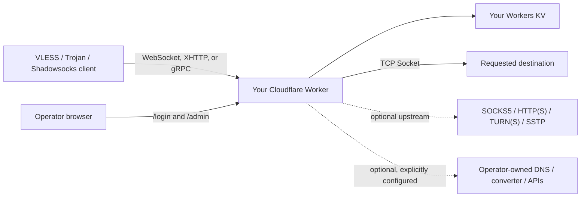

# EdgeTunnel

<p align="center">
  A modular VLESS, Trojan, and Shadowsocks tunnel for Cloudflare Workers.
</p>

<p align="center">
  <a href="README.md">English</a> ·
  <a href="README.zh-CN.md">Simplified Chinese</a> ·
  <a href="README.es.md">Spanish</a> ·
  <a href="README.fa.md">Persian</a>
</p>

<p align="center">
  
  
  
  
</p>

> [!IMPORTANT]
> EdgeTunnel is intended for lawful research, learning, and access to systems you are authorized to use. You are responsible for complying with the laws, Cloudflare terms, and network policies that apply to you.

## What this project is

EdgeTunnel is a modular Cloudflare Worker that accepts **VLESS and Trojan over WebSocket, XHTTP, or gRPC**, plus **Shadowsocks SIP003 AEAD over WebSocket**. It opens outbound TCP connections with Cloudflare's Socket API, directly or through an explicitly configured upstream proxy. Configuration, login sessions, address lists, and request logs are stored in a Workers KV namespace that belongs to the operator.

The runtime does not download code or an administrator panel from another GitHub repository or CDN. Optional remote services are disabled until the operator explicitly configures endpoints they control.

### Current status

| Area | Status |
| --- | --- |
| VLESS over WebSocket/TLS | Supported |
| Trojan over WebSocket/TLS | Supported |
| VLESS/Trojan over XHTTP `stream-one` | Supported; bounded streaming request and response |
| VLESS/Trojan over gRPC Hunk | Supported; fragmented and coalesced frame decoding |
| Shadowsocks `aes-128-gcm` / `aes-256-gcm` | Supported over WebSocket with SIP003 AEAD framing |
| Trojan UDP DNS | Supported when an operator-owned TCP DNS resolver is configured |
| Outbound TCP through Cloudflare Sockets | Supported |
| SOCKS5, HTTP, HTTPS upstream proxies | Supported |
| TURN/TURNS RFC 6062 upstream | Implemented for TCP allocation and connection binding |
| SSTP upstream | Implemented for TLS + PPP PAP/IPCP + IPv4 inner TCP |
| Password login, KV sessions, logout | Supported |
| Token-protected subscriptions | Supported |
| Local address-list subscription | Supported |
| Bounded direct/proxy connection racing | Supported; request-scoped, `1`-`4` dials |
| Local HTTP 204 connectivity-test responder | Supported; no outbound speed-test traffic |
| Mihomo/Clash, Sing-box, Surge conversion | Optional; requires an operator-owned converter |
| Self-contained graphical administrator console | Supported; overview, nodes, preferred IPs, settings, logs, integrations, backup, and security |
| Native Mihomo/Clash and share-link export | Supported; no converter required, with optional preferred-IP substitution |
| Native QUIC/UDP protocols such as Hysteria2 and TUIC | Not supported by this Worker architecture |

> [!NOTE]
> `/admin` is a self-contained management application bundled into the Worker. It does not load a panel, script, font, QR service, or configuration from a third-party host. The tunnel data path and existing subscription routes remain independent of the UI.

## Architecture and trust boundary



Required runtime services:

- Cloudflare Workers.
- One Workers KV namespace bound as `KV`.

Optional integrations, all disabled by default:

- An operator-owned TCP DNS resolver for VLESS and Trojan DNS forwarding.
- An operator-selected SOCKS5, HTTP(S), TURN(S), or SSTP upstream proxy.
- An operator-owned subscription converter and conversion configuration.
- An operator-owned proxy-check endpoint.
- An operator-owned location-data endpoint.
- An operator-selected HTTPS DoH endpoint when ECH is enabled.
- Telegram notifications, a masquerade website, or a Cloudflare usage API.

## Before you begin

You need:

- A Cloudflare account with Workers enabled.
- Node.js and npm.
- Git.
- A terminal.

Cloudflare recommends installing Wrangler locally in each project. The commands below use `npx`, so the project-local version is selected.

## Complete deployment guide

### 1. Clone the repository

```bash
git clone https://github.com/tianrking/Re_edgetunnel.git
cd Re_edgetunnel
```

### 2. Install the current Wrangler CLI locally

```bash
npm install --save-dev wrangler@latest
npx wrangler --version
```

Wrangler 4.x or newer is recommended.

### 3. Sign in to Cloudflare

```bash
npx wrangler login
npx wrangler whoami
```

The first command opens a browser authorization page. The second command confirms the active Cloudflare account.

### 4. Create and bind a dedicated KV namespace

First create a private deployment file. It is ignored by Git, so your KV ID,
custom domain, and optional Cloudflare account ID are not committed:

```bash
cp wrangler.toml wrangler.local.toml
# PowerShell: Copy-Item wrangler.toml wrangler.local.toml
```

Create a namespace:

```bash
npx wrangler kv namespace create KV
```

Wrangler prints an ID. Open `wrangler.local.toml` and replace the placeholder:

```toml
[[kv_namespaces]]
binding = "KV"
id = "paste-your-kv-namespace-id-here"
```

The binding name must remain exactly `KV`, because the Worker reads `env.KV`.

Use a separate namespace for testing and production. Sharing a namespace also shares configuration, sessions, address lists, and logs.

### 5. Validate and create the Worker

Run the automated checks first:

```bash
npm test
npm run check
```

Perform a deployment dry run, then deploy:

```bash
npx wrangler deploy --dry-run --config wrangler.local.toml
npx wrangler deploy --config wrangler.local.toml
```

The first deployment creates the Worker. Until `ADMIN` is configured, HTTP requests intentionally return `503 Administrator password is not configured.`

### 6. Set the administrator password as a Cloudflare Secret

Generate a strong value locally if needed:

```bash
node -e "console.log(require('node:crypto').randomBytes(32).toString('base64url'))"
```

Store it interactively. Do not put the value in source code or `wrangler.toml`.

```bash
npx wrangler secret put ADMIN --config wrangler.local.toml
```

Wrangler prompts for the value without requiring it in the command line. `secret put` creates and immediately deploys a new Worker version.

### 7. Set a separate RFC 4122 version-4 UUID

The UUID is the VLESS credential and is also used as the Trojan password. Generate one:

```bash
node -e "console.log(require('node:crypto').randomUUID())"
```

Store it as a secret:

```bash
npx wrangler secret put UUID --config wrangler.local.toml
```

Use different values for `ADMIN` and `UUID`. Rotating `UUID` immediately invalidates old node links and subscriptions.

Confirm that both secret names exist:

```bash
npx wrangler secret list --config wrangler.local.toml
```

Cloudflare displays secret names, not their values.

### 8. Open the deployed Worker

Wrangler prints a URL similar to:

```text
https://edgetunnel.<your-workers-subdomain>.workers.dev
```

The root path normally displays an nginx-style camouflage page. This is expected. Open the login page instead:

```text
https://edgetunnel.<your-workers-subdomain>.workers.dev/login
```

Sign in with the `ADMIN` value, then open `/admin`.

## First use: obtain a node and subscription

### Obtain nodes and subscriptions from the console

After logging in:

1. Open `/admin`.
2. Open **Nodes & subscriptions**.
3. Copy a VLESS, Trojan, or Shadowsocks URI, show its local QR code, or download the native Mihomo/Clash YAML.
4. Import the result into a compatible client.

The console generates WebSocket, XHTTP, and gRPC entries according to the enabled transports. Credentials are never displayed as a separate plaintext field, but they are necessarily present in copied node URIs and protected subscription output.

### Build the subscription URL

The console displays ready-to-copy native subscription URLs. For legacy or automated administration, the unique `TOKEN` property is also available from the authenticated `/admin/config.json` endpoint:

```text
https://YOUR_WORKER_HOST/sub?token=YOUR_TOKEN
```

Treat the subscription URL as a password. Anyone who has it can retrieve the generated nodes.

### Subscription output formats

| Requested output | URL suffix | Requirements |
| --- | --- | --- |
| Raw URI list in a browser | `/sub?token=TOKEN` | No external service |
| Base64 URI subscription | `/sub?token=TOKEN&base64` | No external service |
| Native Mihomo/Clash YAML | `/sub?token=TOKEN&format=clash` | No external service |
| Native share-link text | `/sub?token=TOKEN&format=links` | No external service |
| Native Clash using a preferred IP | `/sub?token=TOKEN&format=clash&ip=104.18.35.249` | A locally tested Cloudflare IPv4 or IPv6 address |
| Legacy converted Mihomo/Clash YAML | `/sub?token=TOKEN&clash` | Operator-owned `SUBAPI` and `SUBCONFIG` |
| Sing-box JSON | `/sub?token=TOKEN&singbox` | Operator-owned `SUBAPI` and `SUBCONFIG` |
| Surge configuration | `/sub?token=TOKEN&surge` | Operator-owned `SUBAPI` and `SUBCONFIG` |
| Quantumult X conversion | `/sub?token=TOKEN&quanx` | Operator-owned `SUBAPI` and `SUBCONFIG` |
| Loon conversion | `/sub?token=TOKEN&loon` | Operator-owned `SUBAPI` and `SUBCONFIG` |

For native output, optional parameters are `ip`, `port`, `name`, and `download=1`. A preferred IP changes only the node's connection `server` and optional `port`; TLS `servername`/SNI, HTTP `Host`, tunnel path, and credentials continue to identify the Worker hostname. The console validates IPv4/IPv6 input and can store up to 128 local scan results in the current deployment's KV.

The console does not scan the local ISP path from Cloudflare. Run an IP latency scanner on the client network, import its results, and test the generated node in the actual client. Mihomo, Sing-box, Surge, Quantumult X, and Loon remain **client configuration formats**, not additional Worker inbound protocols. A legacy conversion request returns HTTP 501 when the operator has not configured a converter; the native `format=clash` and `format=links` outputs never require one.

## Optional standalone Clash subscription Worker

The repository also includes an optional companion Worker that generates a
password-protected Mihomo/Clash YAML file and share links directly, without a
public subscription converter. It is a separate deployment and must be
configured with your own tunnel hostname and Cloudflare secrets.

Follow the complete generic guide in
[workers/clash-sub/README.md](workers/clash-sub/README.md). Keep account IDs,
KV IDs, custom domains, UUIDs, passwords, and subscription tokens in ignored
local configuration or Cloudflare Secrets; never add a per-account Wrangler
file to the repository.

## Using the administrator console

The administrator routes require a valid KV-backed session. A session expires after 24 hours; logout revokes it immediately.

| Route | Method | Purpose |
| --- | --- | --- |
| `/login` | GET, POST | Display the local login form and create a session |
| `/admin` | GET | Display the self-contained responsive administrator console |
| `/admin/api/bootstrap` | GET | Read the sanitized console model, native exports, preferred IPs, and recent logs |
| `/admin/api/preview` | GET | Preview nodes and exports for the Worker hostname or a validated preferred IP |
| `/admin/api/settings` | POST | Save the UI-managed subscription settings while preserving unrelated configuration |
| `/admin/api/preferred-ips` | POST | Import, normalize, deduplicate, and save preferred IPv4/IPv6 results |
| `/admin/api/backup` | GET | Export UI settings and preferred IPs without administrator, UUID, token, or integration secrets |
| `/admin/api/restore` | POST | Restore a validated console backup |
| `/admin/config.json` | GET | Read the effective configuration, generated `LINK`, and subscription token |
| `/admin/config.json` | POST | Save configuration JSON to KV |
| `/admin/ADD.txt` | GET | Read the saved address list or a locally generated fallback list |
| `/admin/ADD.txt` | POST | Save an operator-controlled address list to KV |
| `/admin/log.json` | GET | Read request logs |
| `/admin/init` | POST | Reset `config.json` to defaults; does not erase the address list or logs |
| `/admin/check` | GET | Test an upstream SOCKS5/HTTP proxy against the configured operator-owned endpoint |
| `/logout` | GET | Revoke the current session and clear the cookie |

All configuration-changing POST requests require a same-origin `Origin` or `Referer` header. This is a CSRF protection, not an error.

### Edit configuration from the browser

Use **Service settings** in `/admin` for the subscription name, tunnel path, transports, TLS fingerprint, refresh interval, Shadowsocks, 0-RTT, and certificate-verification behavior. The page also provides safe backup/restore and a UI-only default reset. The reset preserves unrelated operator configuration, preferred IPs, `ADMIN`, and `UUID`.

The raw endpoint below remains available for advanced or backward-compatible administration.

The stored JSON schema retains legacy internal property names for backward compatibility. To keep this guide language-neutral and avoid typing those names manually, the example below locates the subscription object through its stable ASCII properties.

Log in, open `/admin`, open the browser developer console, and run:

```js
const config = await fetch('/admin/config.json').then((response) => response.json());

const subscription = Object.values(config).find((value) =>
  value && typeof value === 'object' &&
  typeof value.TOKEN === 'string' &&
  typeof value.SUBNAME === 'string'
);

if (!subscription) throw new Error('Subscription settings were not found');

// Example: change the display name without depending on localized JSON keys.
subscription.SUBNAME = 'my-edgetunnel';

const response = await fetch('/admin/config.json', {
  method: 'POST',
  headers: { 'Content-Type': 'application/json' },
  body: JSON.stringify(config),
});

console.log(response.status, await response.text());
```

A successful save returns `{"success":true}`. Refresh `/admin/config.json` to confirm the effective value.

### Save your own address list

Accepted line format:

```text
hostname-or-ip:port#display name
```

Examples:

```text
example.com:443#Primary
203.0.113.10:443#IPv4 example
[2001:db8::10]:443#IPv6 example
```

The documentation addresses above are examples; replace them with endpoints you are authorized to use. Invalid lines and ports outside `1-65535` are ignored.

From the same authenticated browser console:

```js
const addresses = `example.com:443#Primary
203.0.113.10:443#Backup`;

const response = await fetch('/admin/ADD.txt', {
  method: 'POST',
  headers: { 'Content-Type': 'text/plain; charset=utf-8' },
  body: addresses,
});

console.log(response.status, await response.text());
```

### Reset the main configuration

```js
const response = await fetch('/admin/init', { method: 'POST' });
console.log(response.status, await response.text());
```

This replaces `config.json` with defaults. It does not delete `ADD.txt`, logs, active sessions, Telegram settings, or saved Cloudflare usage settings.

## Important configuration settings

| Setting | Default | Meaning |
| --- | --- | --- |
| Generated node protocol | `vless` | Selects VLESS or Trojan links |
| Supported protocols | VLESS and Trojan | Informational capability list enforced by the runtime |
| Transport | WebSocket | Client-to-Worker transport |
| Host list | Current Worker host | Hostnames used when generating subscriptions |
| Skip certificate verification | Disabled | Disables client certificate verification when enabled; not recommended |
| 0-RTT | Disabled | Adds WebSocket early-data query data to generated paths |
| Random path mode | Disabled | Uses `/` in locally generated subscription nodes when enabled |
| TLS fingerprint | `chrome` | Client TLS fingerprint hint |
| ECH | Disabled | Generates ECH client settings only when an HTTPS DoH endpoint is supplied |
| Local subscription generation | Enabled | Generates subscriptions from the local KV address list |
| Subscription name | `edgetunnel` | Subscription and node display name; stored as `SUBNAME` |
| Subscription update interval | 3 hours | Suggested client refresh interval; stored as `SUBUpdateTime` |
| Locally generated address count | `16` | Number of fallback addresses when no list is saved |
| Converter API | Not configured | Operator-owned converter base URL; stored as `SUBAPI` |
| Converter configuration | Not configured | Operator-owned HTTPS converter configuration; stored as `SUBCONFIG` |
| Sing-box rule-set base | Not configured | Operator-owned `.srs` rule-set base URL |
| Client DNS list | Empty | Resolvers explicitly inserted into generated Clash configuration |
| Telegram notifications | Disabled | Sends request notifications after credentials are configured |

`HOST`, `UUID`, `PATH`, `LINK`, `TOKEN`, timestamps, usage data, and load timing are runtime-derived values. The Worker can overwrite them when reading the saved JSON.

## Deployment variables and optional integrations

Sensitive values must be stored with `wrangler secret put`. Non-secret operator settings may be placed under `[vars]` in `wrangler.toml`.

| Variable | Required | Purpose |
| --- | --- | --- |
| `ADMIN` | Yes | Administrator password; store as a Secret |
| `UUID` | Strongly recommended | RFC 4122 v4 VLESS/Trojan credential; store as a Secret |
| `KEY` | No | Additional secret input and optional private subscription shortcut; store as a Secret |
| `HOST` | No | Comma/newline-separated hostnames used in generated subscriptions |
| `URL` | No | Root-path camouflage: `nginx`, `1101`, or an explicit HTTPS origin |
| `PROXYIP` | No | Operator-selected TCP fallback proxy address |
| `UPSTREAM_PROXY` | No | Absolute `socks5://`, `http://`, `https://`, `turn://`, `turns://`, or `sstp://` upstream URL |
| `TCP_CONCURRENT_DIAL` | No | Direct TCP race width, clamped to `1`-`4`; default `1` |
| `PROXY_CONCURRENT_DIAL` | No | Proxy-candidate race width, clamped to `1`-`4`; default `1` |
| `SPEEDTEST_MODE` | No | `local` (default) returns bounded local HTTP 204 responses; `block` closes the tunnel |
| `SPEEDTEST_DOMAINS` | No | Comma/newline-separated local-test domains; defaults to `speed.cloudflare.com` and `cp.cloudflare.com` |
| `DNS_RESOLVER` | No | Operator-owned TCP DNS resolver for VLESS/Trojan DNS and TURN/SSTP target resolution |
| `DNS_RESOLVER_PORT` | No | DNS resolver port, default `53` |
| `PROXY_CHECK_HOST` | No | Operator-owned HTTP endpoint host used for proxy tests |
| `PROXY_CHECK_PORT` | No | Proxy-check endpoint port, default `80` |
| `PROXY_CHECK_PATH` | No | Proxy-check HTTP path, default `/` |
| `LOCATIONS_API` | No | Operator-owned HTTPS location-data endpoint |
| `ECH_DOH_URL` | No | Explicit HTTPS DoH endpoint used only for ECH lookup |
| `ALLOW_REMOTE_USAGE_API` | No | Must equal `true` before a saved remote usage URL may be requested |

If an optional endpoint is absent, the related feature is disabled. The Worker does not select a hidden public fallback.

Dial settings are parsed per request, never retained as mutable cross-request state. Local speed-test mode opens no outbound socket, accepts split or keep-alive HTTP requests, and enforces header, body, pipeline, and buffer limits.

## Custom domain

Add a domain already managed in your Cloudflare account:

```toml
routes = [
  { pattern = "tunnel.example.com", custom_domain = true }
]
```

Redeploy:

```bash
npx wrangler deploy
```

After changing the hostname, retrieve `/admin/config.json` again. Subscription tokens are derived from the hostname and UUID, so the old hostname's token is not valid on the new hostname.

## Updating and rolling back

Update from GitHub and validate before deployment:

```bash
git pull --ff-only
npm test
npm run check
npx wrangler deploy --dry-run
npx wrangler deploy
```

Inspect recent versions or roll back with Wrangler:

```bash
npx wrangler versions list
npx wrangler rollback
```

Back up important KV values before destructive configuration changes. At minimum, save `config.json` and `ADD.txt` from the authenticated administrator routes.

## Protocol boundaries

Supported:

- VLESS and Trojan over WebSocket, XHTTP `stream-one`, and gRPC Hunk, with TLS termination at Cloudflare.
- Shadowsocks SIP003 AEAD using `aes-128-gcm` or `aes-256-gcm` over WebSocket.
- TCP destinations reachable through Cloudflare's outbound Socket API.
- VLESS and Trojan DNS forwarding only when an operator-owned TCP DNS resolver is configured.
- SOCKS5, HTTP CONNECT, HTTPS CONNECT, TURN/TURNS RFC 6062, and SSTP as optional **upstream** proxies, not inbound client protocols.

Not supported by this Worker:

- Hysteria2 and TUIC, which require native QUIC/UDP behavior.
- WireGuard as an inbound tunnel.
- VLESS Reality, because TLS is terminated by Cloudflare.
- Native raw-TCP ingress or a generic HTTP forward proxy.
- Arbitrary UDP forwarding; only explicitly configured VLESS/Trojan DNS is handled.

TURN support is intentionally scoped to RFC 6062 TCP allocation. SSTP support is scoped to TLS, PPP PAP/IPCP, IPv4, and inner TCP. Servers requiring other authentication methods, IPv6CP, MPPE, or vendor extensions are outside this implementation.

Adding a client output format does not add a new network protocol to the Worker core.

## Security model

- Login sessions use random 256-bit tokens; only SHA-256-derived session keys are stored in KV.
- Session cookies are `HttpOnly`, `Secure`, and `SameSite=Strict`.
- Sessions expire after 24 hours and are removed on logout.
- Administrator mutations require a trusted same-origin request.
- Subscription endpoints require a token derived from the Worker hostname and UUID.
- Credentials are removed from stored request-log URLs.
- Remote runtime integrations are opt-in and require explicit operator configuration.

Operational recommendations:

- Never commit `ADMIN`, `UUID`, API tokens, cookies, or subscription URLs.
- Keep client certificate verification enabled.
- Use separate Workers and KV namespaces for staging and production.
- Rotate `ADMIN` after suspected disclosure. Existing sessions remain active until logout or their 24-hour expiry.
- Rotate `UUID` when a node or subscription leaks; all clients must then import the new link.
- Protect Cloudflare API tokens with the minimum permissions required.

## Troubleshooting

### The root page only shows “Welcome to nginx”

This is the default camouflage page. Open `/login`, not `/`.

### `/admin` redirects to the login page or does not load its assets

Sign in at `/login`, confirm that the `KV` binding is available, and make sure `/assets/edgetunnel-ui.css` and `/assets/edgetunnel-admin.js` are not blocked by a browser extension or an additional reverse proxy. The console itself has no external runtime asset dependency.

### `503 Administrator password is not configured`

Set the secret and wait for the new version to deploy:

```bash
npx wrangler secret put ADMIN
```

### `503` or a message about the KV binding

Confirm that `wrangler.toml` contains a real namespace ID and that the binding is named `KV`.

### `403 Invalid Token`

Read the current token from `/admin/config.json`. Confirm that the URL hostname is exactly the same hostname used to retrieve the token. Custom domains and `workers.dev` names have different tokens.

### A legacy Clash, Sing-box, or Surge request returns `501`

This is expected until the converter-settings object contains both `SUBAPI` and `SUBCONFIG` values pointing to HTTPS services controlled by the operator. Raw, Base64, native `format=clash`, and native `format=links` subscriptions do not need a converter.

### Proxy testing returns `503`

Set `PROXY_CHECK_HOST`, `PROXY_CHECK_PORT`, and `PROXY_CHECK_PATH` to your own test endpoint. No public proxy-check service is selected automatically.

### WebSocket connects but the destination does not respond

Check the UUID/password, TLS host/SNI, WebSocket host and path, destination port, Cloudflare logs, and whether Cloudflare permits the requested outbound destination.

Stream production logs:

```bash
npx wrangler tail
```

## Development and verification

Run syntax and unit checks:

```bash
npm run check
npm test
```

Available Cloudflare verification scripts:

```bash
npm run test:cloudflare:http
npm run test:cloudflare
```

The Cloudflare scripts require a deliberately created test Worker/KV environment and test credentials. Do not run destructive tests against production data.

## Project layout

```text
src/
├── index.js                 # Worker entry point and routing
├── config.js                # Defaults, KV configuration, links, logs
├── controllers/
│   ├── auth.js              # Login, sessions, origin checks, logout
│   ├── admin.js             # Legacy and console administrator routing
│   ├── admin-api.js         # Sanitized console API and mutations
│   └── sub.js               # Subscription generation and conversion
├── core/
│   ├── dialer.js            # Bounded connection racing and loser cleanup
│   ├── proxy.js             # WebSocket and outbound socket lifecycle
│   └── speedtest.js         # Bounded local HTTP 204 responder
├── protocols/
│   ├── parsers.js           # VLESS and Trojan parsing
│   └── socks5.js            # Optional SOCKS5/HTTP upstream support
├── subscriptions/native.js  # Native Clash/share links and preferred-IP substitution
├── ui/                       # Bundled pages, styles, scripts, and local QR rendering
└── utils/                    # Address parsing, patches, proxy checks, helpers
```

## Acknowledgements

The implementation was inspired by community work, especially:

- [cmliu/edgetunnel](https://github.com/cmliu/edgetunnel)
- [zizifn/edgetunnel](https://github.com/zizifn/edgetunnel)

The current runtime is modularized in this repository and does not load those repositories at runtime.

## License and disclaimer

See [LICENSE](LICENSE). Use this software only for legal purposes and on networks and systems you are authorized to access. The maintainers are not responsible for misuse or resulting loss.
