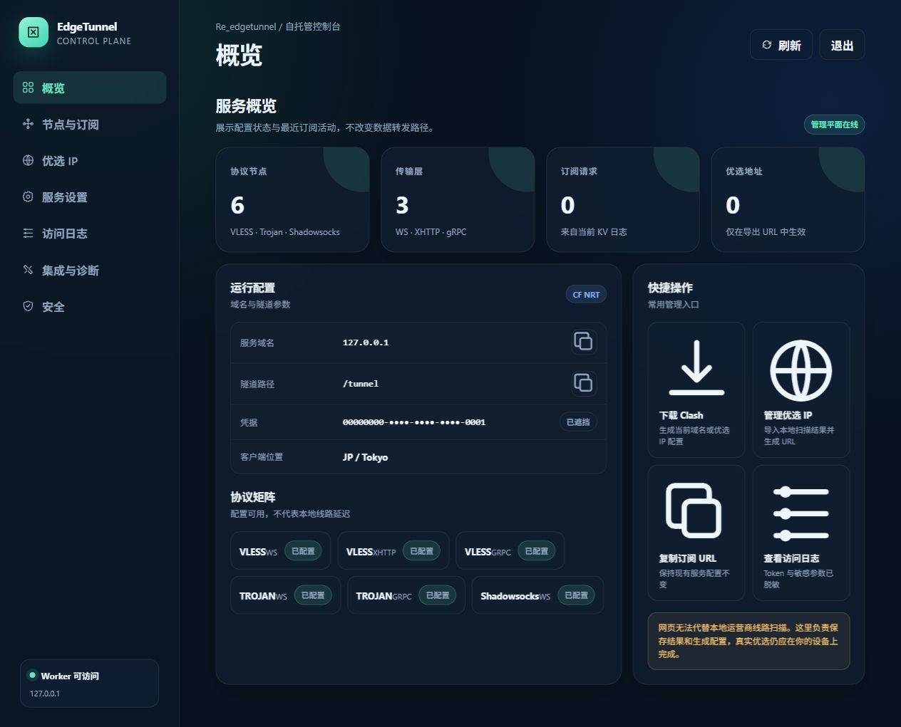
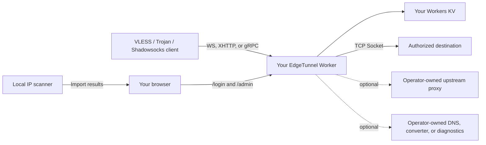
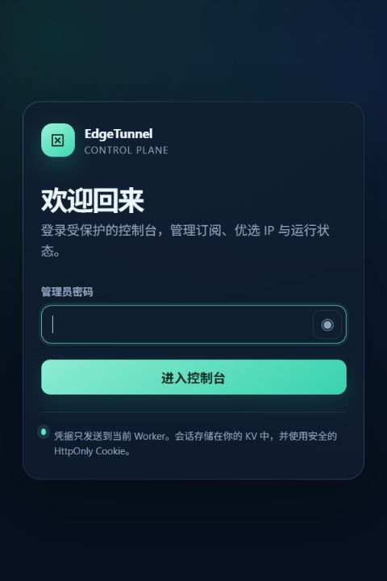
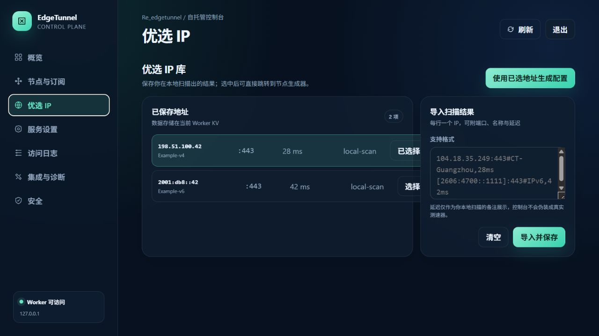
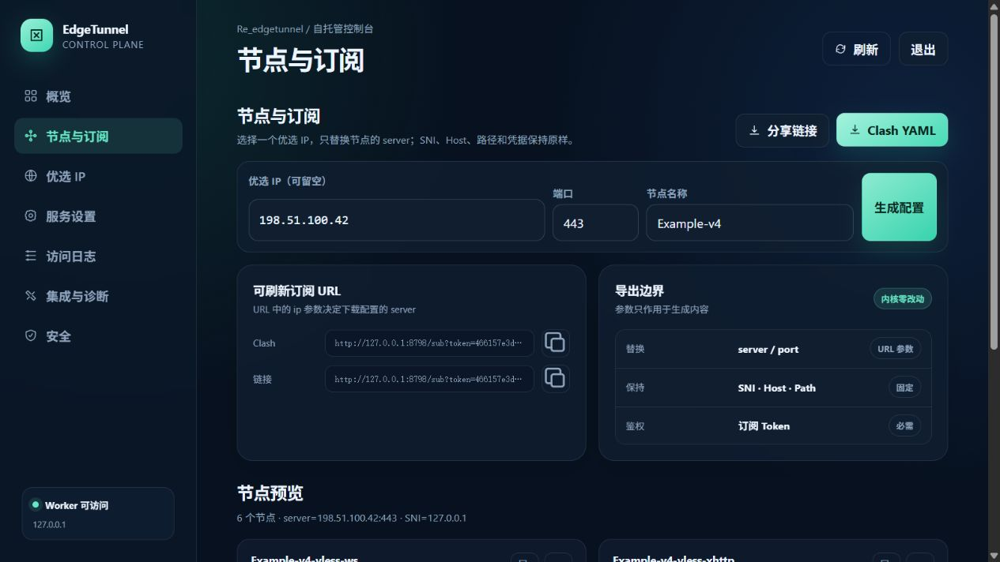

# Re_edgetunnel

<p align="center">
  A self-hosted Cloudflare Worker tunnel with a built-in control console, native subscriptions, and preferred-IP exports.
</p>

<p align="center">
  <a href="README.md">English</a> ·
  <a href="README.zh-CN.md">Simplified Chinese</a> ·
  <a href="README.es.md">Spanish</a> ·
  <a href="README.fa.md">Persian</a>
</p>

<p align="center">
  
  
  
  
</p>

<p align="center">
  
</p>

Re_edgetunnel accepts VLESS and Trojan traffic over WebSocket, XHTTP, or gRPC, and Shadowsocks SIP003 AEAD over WebSocket. Outbound TCP connections are opened through Cloudflare's Socket API. The same Worker serves a local administration console for subscriptions, preferred Cloudflare IPs, settings, logs, integrations, backup, and recovery.

No panel, JavaScript bundle, font, QR service, or runtime configuration is downloaded from a third-party host. The Worker code, UI assets, and QR renderer are all shipped in this repository. Optional integrations remain off until the operator supplies an endpoint.

> [!IMPORTANT]
> Use this software only for lawful work and for systems and networks you are authorized to access. The operator is responsible for Cloudflare's terms, local law, client configuration, and destination policy.

## At a glance

| Area | Included |
| --- | --- |
| Inbound protocols | VLESS, Trojan, Shadowsocks SIP003 AEAD |
| Transports | WebSocket, XHTTP `stream-one`, gRPC Hunk; Shadowsocks uses WebSocket |
| Outbound | TCP through `cloudflare:sockets`, direct or through an operator-configured upstream proxy |
| Native exports | Mihomo/Clash YAML and share links; no public converter required |
| Preferred IPs | Import local scan results, store them in KV, and generate persistent URLs with `ip`, `port`, and `name` |
| Administration | Password login, KV sessions, overview, nodes, settings, logs, integrations, backup/restore, logout |
| Optional upstreams | SOCKS5, HTTP CONNECT, HTTPS CONNECT, TURN/TURNS RFC 6062, SSTP |
| Not provided | A local ISP scanner, native QUIC/UDP inbound, Hysteria2, TUIC, WireGuard, or VLESS Reality |

The console is currently written in Simplified Chinese. Its exports and network protocols are language-neutral; this repository provides English, Chinese, Spanish, and Persian operating guides.

## How the pieces fit together



The data path and the control console share one Worker but remain separate routes. Opening `/admin` does not change tunnel forwarding. Preferred-IP exports change the client connection address only; they do not reroute Worker egress.

## Screenshots

These screenshots were captured from the current source running locally with a synthetic UUID and RFC documentation addresses. They contain no production domain, account identifier, subscription token, or live credential.

### Login

<p align="center">
  
</p>

### Preferred-IP library

<p align="center">
  
</p>

### Node and subscription builder

<p align="center">
  
</p>

## Requirements

- A Cloudflare account with Workers enabled.
- A Workers KV namespace dedicated to this deployment.
- A current Node.js LTS release, npm, and Git.
- A custom domain in the same Cloudflare account if you want zone-level gRPC support.
- A compatible client such as Mihomo/Clash for the generated configuration.

This project targets Cloudflare Workers because it uses `cloudflare:sockets`. It is not a drop-in Vercel Function or Vercel Edge Function.

## Deploy from a clean checkout

### 1. Clone and install

```bash
git clone https://github.com/tianrking/Re_edgetunnel.git
cd Re_edgetunnel
npm ci
```

Use a project-local Wrangler installation when you want a pinned deployment tool:

```bash
npm install --save-dev wrangler@latest
npx wrangler --version
```

### 2. Sign in to the correct Cloudflare account

```bash
npx wrangler login
npx wrangler whoami
```

Always read the `whoami` output before creating KV or deploying. This avoids placing a Worker in the wrong account.

### 3. Create a private Wrangler file

The tracked `wrangler.toml` is a public template. Copy it to the ignored local filename before adding deployment-specific values:

```bash
cp wrangler.toml wrangler.local.toml
# PowerShell: Copy-Item wrangler.toml wrangler.local.toml
```

You may change the Worker `name` in `wrangler.local.toml`. Do not commit this local file.

### 4. Create and bind KV

```bash
npx wrangler kv namespace create KV
```

Wrangler prints a namespace ID. Replace the placeholder only in `wrangler.local.toml`:

```toml
[[kv_namespaces]]
binding = "KV"
id = "paste-your-kv-namespace-id-here"
```

The binding name must remain `KV`. Use separate namespaces for production and testing; sharing KV also shares settings, address lists, logs, and active sessions.

### 5. Run the local checks and deploy

```bash
npm run check
npm test
npx wrangler deploy --dry-run --config wrangler.local.toml
npx wrangler deploy --config wrangler.local.toml
```

Before `ADMIN` is configured, normal HTTP requests intentionally return `503 Administrator password is not configured.`

### 6. Store the two required credentials as Secrets

Generate an administrator password and a separate RFC 4122 version-4 UUID locally:

```bash
node -e "console.log(require('node:crypto').randomBytes(32).toString('base64url'))"
node -e "console.log(require('node:crypto').randomUUID())"
```

Enter each value at Wrangler's interactive prompt:

```bash
npx wrangler secret put ADMIN --config wrangler.local.toml
npx wrangler secret put UUID --config wrangler.local.toml
npx wrangler secret list --config wrangler.local.toml
```

- `ADMIN` is the password for `/login`.
- `UUID` is the VLESS credential and the Trojan/Shadowsocks password used in generated nodes.
- The subscription `TOKEN` is not the administrator password. It is derived from the active hostname and UUID.

Use different values for `ADMIN` and `UUID`. Rotating `ADMIN` does not change nodes. Rotating `UUID` invalidates existing nodes and changes the subscription token.

### 7. Add a custom domain, if needed

Add the route only to `wrangler.local.toml`:

```toml
routes = [
  { pattern = "tunnel.example.com", custom_domain = true }
]
```

Deploy again:

```bash
npx wrangler deploy --config wrangler.local.toml
```

For gRPC, enable gRPC in the Cloudflare zone's Network settings and keep the client SNI/servername on the custom hostname. A `workers.dev` hostname and a custom hostname produce different subscription tokens.

### 8. Log in

Open:

```text
https://tunnel.example.com/login
```

Sign in with the value stored in `ADMIN`. The root URL normally shows an nginx-style camouflage page; that is expected.

## First use

### Get a native Clash subscription

After login:

1. Open **Nodes & subscriptions**.
2. Leave the preferred IP empty to use the Worker hostname, or select an address imported from your local scan.
3. Generate the preview.
4. Copy the refreshable URL or download Mihomo/Clash YAML.
5. Import it into the client and test the actual route.

Native endpoints:

| Output | URL |
| --- | --- |
| Raw URI list | `/sub?token=TOKEN` |
| Base64 URI list | `/sub?token=TOKEN&base64` |
| Mihomo/Clash YAML | `/sub?token=TOKEN&format=clash` |
| Share-link text | `/sub?token=TOKEN&format=links` |
| Clash with a preferred address | `/sub?token=TOKEN&format=clash&ip=IP` |
| Download instead of inline display | Add `&download=1` |

Native preferred-IP parameters:

| Parameter | Meaning |
| --- | --- |
| `ip` | Valid IPv4 or IPv6 connection address |
| `port` | Optional port from `1` to `65535`; default `443` |
| `name` | Optional node label, limited and sanitized by the Worker |

Treat every subscription URL as a credential. Do not paste it into an issue, screenshot, analytics service, or public converter.

### Use a locally scanned Cloudflare IP

The Worker cannot measure the path between your ISP and Cloudflare. Run the scanner on the device or network that will use the tunnel, then import the result into `/admin`.

Accepted import lines:

```text
IP
IP:PORT
IP:PORT#LABEL
IP:PORT#LABEL,28ms
[IPv6]:PORT#LABEL,42ms
```

Documentation-only examples:

```text
198.51.100.42:443#Example-v4,28ms
[2001:db8::42]:443#Example-v6,42ms
```

When `ip` is used, Re_edgetunnel changes only the generated node's `server` and optional `port`:

| Field | Result |
| --- | --- |
| `server` / connection address | Replaced with the selected IP |
| TLS `servername` / SNI | Keeps the Worker hostname |
| WebSocket `Host` | Keeps the Worker hostname |
| XHTTP `host` | Keeps the Worker hostname |
| gRPC service name | Keeps the configured tunnel path without the leading slash |
| UUID/password and path | Unchanged |

Changing `server`, SNI, Host, and path to the same IP breaks Cloudflare routing. The IP is only the edge connection target; the hostname still identifies your Worker.

## Administration console

The console uses a random 256-bit session token stored as a SHA-256-derived key in KV. Its cookie is `HttpOnly`, `Secure`, and `SameSite=Strict`. Sessions expire after 24 hours; logout revokes the active session immediately.

| Section | What it does |
| --- | --- |
| Overview | Shows protocol/transport status, host, tunnel path, masked credential, recent subscription count, and preferred-IP count |
| Nodes & subscriptions | Builds VLESS, Trojan, and Shadowsocks nodes; renders local QR codes; exports links and Clash YAML |
| Preferred IP | Imports, validates, deduplicates, stores, selects, and deletes up to 128 IPv4/IPv6 results |
| Service settings | Changes subscription name, tunnel path, transports, fingerprint, refresh interval, certificate policy, 0-RTT, and Shadowsocks settings |
| Access logs | Reads KV-backed request records with credential-bearing query parameters removed |
| Integrations & diagnostics | Displays explicitly configured converter, proxy check, usage API, DNS, ECH, Telegram, and masquerade options |
| Security | Exports a secret-free backup, restores validated settings, and resets UI-managed defaults |

Important routes:

| Route | Method | Purpose |
| --- | --- | --- |
| `/login` | GET, POST | Create an administrator session |
| `/admin` | GET | Load the self-contained console |
| `/admin/api/bootstrap` | GET | Return the sanitized console model and native exports |
| `/admin/api/preview` | GET | Preview nodes for the hostname or a preferred IP |
| `/admin/api/settings` | POST | Save UI-managed settings without discarding unrelated configuration |
| `/admin/api/preferred-ips` | POST | Import and store local scan results |
| `/admin/api/backup` | GET | Export settings and IPs without administrator, UUID, token, or integration secrets |
| `/admin/api/restore` | POST | Restore a validated console backup |
| `/admin/config.json` | GET, POST | Advanced access to the effective legacy-compatible configuration |
| `/admin/ADD.txt` | GET, POST | Read or replace the operator-owned address list |
| `/admin/log.json` | GET | Read request logs |
| `/admin/init` | POST | Reset `config.json`; does not erase address lists or logs |
| `/admin/check` | GET | Test an explicitly configured SOCKS5/HTTP upstream |
| `/logout` | GET | Revoke the current session |

Configuration-changing POST requests require a same-origin `Origin` or `Referer` header as CSRF protection.

## Runtime configuration

Keep secrets in Cloudflare Secrets. Put non-sensitive values in the ignored `wrangler.local.toml` only when they must be deployment-specific.

| Variable | Recommended storage | Purpose |
| --- | --- | --- |
| `ADMIN` | Secret; required | Administrator password |
| `UUID` | Secret; strongly recommended | Canonical v4 UUID used by generated nodes |
| `KEY` | Secret; optional | Additional private shortcut path and legacy secret key |
| `HOST` | Variable; optional | Override generated host list |
| `PATH` | Variable; optional | Tunnel path; default `/tunnel` |
| `URL` | Variable; optional | Root camouflage: `nginx`, `1101`, or an explicit HTTPS origin |
| `PROXYIP` | Variable or Secret | Operator-selected fallback proxy IP |
| `UPSTREAM_PROXY` | Secret when credentialed | `socks5://`, `http://`, `https://`, `turn://`, `turns://`, or `sstp://` upstream |
| `TCP_CONCURRENT_DIAL` | Variable | Direct connection race width, clamped to `1`-`4` |
| `PROXY_CONCURRENT_DIAL` | Variable | Proxy candidate race width, clamped to `1`-`4` |
| `SPEEDTEST_MODE` | Variable | `local` returns bounded local HTTP 204 responses; `block` closes the test tunnel |
| `SPEEDTEST_DOMAINS` | Variable | Domains handled by the local connectivity-test path |
| `DNS_RESOLVER` / `DNS_RESOLVER_PORT` | Variable | Operator-owned TCP DNS for supported DNS forwarding and TURN/SSTP resolution |
| `PROXY_CHECK_HOST` / `PORT` / `PATH` | Variable | Operator-owned HTTP endpoint used by proxy diagnostics |
| `LOCATIONS_API` | Variable | Operator-owned HTTPS location data endpoint |
| `ECH_DOH_URL` | Variable | Explicit HTTPS DoH endpoint used only when ECH is enabled |
| `ALLOW_REMOTE_USAGE_API` | Variable | Must be `true` before a stored remote Cloudflare usage API is called |

Legacy aliases such as `PASSWORD` or `TOKEN` are accepted for compatibility, but new deployments should use `ADMIN`. Do not place any credential, Cloudflare account ID, KV namespace ID, private domain, or generated subscription URL in a tracked file.

## Optional subscription conversion

Native `format=clash` and `format=links` exports never require a converter. Legacy client-format requests are available only after you configure your own HTTPS converter and configuration URL:

| Request | External requirement |
| --- | --- |
| `?clash` | Operator-owned `SUBAPI` and `SUBCONFIG` |
| `?singbox` | Operator-owned `SUBAPI` and `SUBCONFIG` |
| `?surge` | Operator-owned `SUBAPI` and `SUBCONFIG` |
| `?quanx` | Operator-owned `SUBAPI` and `SUBCONFIG` |
| `?loon` | Operator-owned `SUBAPI` and `SUBCONFIG` |

Without those values the Worker returns HTTP 501 instead of silently sending the subscription to a public service.

## Optional standalone Clash Worker

`workers/clash-sub` is a separate, password-protected Worker that can publish a Clash-only subscription for one EdgeTunnel hostname. It has its own generic Wrangler template and requires these Secrets:

- `SECRET_TOKEN`
- `PAGE_PASSWORD`
- `CLOUDFLARE_UUID`

It also requires `CLOUDFLARE_HOST`, and the UUID must match the main Worker. See [workers/clash-sub/README.md](workers/clash-sub/README.md). Do not copy a personal deployment file into the repository.

## Protocol boundaries

Supported:

- VLESS over WebSocket, XHTTP `stream-one`, and gRPC Hunk.
- Trojan over WebSocket, XHTTP at the Worker route, and gRPC Hunk; native Clash export emits the client combinations it can describe safely.
- Shadowsocks `aes-128-gcm` and `aes-256-gcm` with SIP003 AEAD framing over WebSocket.
- TCP destinations reachable through Cloudflare's Socket API.
- VLESS/Trojan DNS when an operator-owned TCP resolver is configured.
- SOCKS5, HTTP(S) CONNECT, TURN(S) RFC 6062, and SSTP as upstream paths.

Not supported:

- Hysteria2 or TUIC, because they require native QUIC/UDP.
- WireGuard inbound.
- VLESS Reality, because Cloudflare terminates TLS.
- Arbitrary UDP forwarding; the implemented UDP case is configured VLESS/Trojan DNS.
- A native TCP listener or a general-purpose HTTP forward proxy.

TURN is limited to RFC 6062 TCP allocation and connection binding. SSTP is limited to TLS, PPP PAP/IPCP, IPv4, and inner TCP; it does not claim MPPE, IPv6CP, or vendor-extension coverage.

## Security and publication checklist

Before every public commit:

- Keep `wrangler.local.toml`, `.dev.vars`, and `.wrangler/` untracked.
- Store `ADMIN`, `UUID`, proxy credentials, API tokens, and companion-Worker credentials as Secrets.
- Use reserved examples such as `198.51.100.0/24` and `2001:db8::/32` in documentation.
- Capture screenshots from a synthetic local deployment, not production.
- Check the current tree and the full reachable Git history; deleting a secret in a later commit does not remove it from earlier commits.
- Rotate any credential that was ever committed, even after history is rewritten.

Request logs remove common credential-bearing query parameters before storage. Backups omit `ADMIN`, UUID, subscription token, sessions, and integration secrets. This reduces accidental disclosure; it does not make a public subscription URL safe to share.

## Upgrade and rollback

```bash
git pull --ff-only
npm ci
npm run check
npm test
npx wrangler deploy --dry-run --config wrangler.local.toml
npx wrangler deploy --config wrangler.local.toml
```

Cloudflare keeps Worker versions:

```bash
npx wrangler versions list --config wrangler.local.toml
npx wrangler rollback --config wrangler.local.toml
```

Export a console backup before changing stored settings. A code rollback does not automatically roll back KV data.

## Troubleshooting

### The root page says "Welcome to nginx"

That is the default camouflage page. Open `/login`.

### `503 Administrator password is not configured`

```bash
npx wrangler secret put ADMIN --config wrangler.local.toml
```

### KV binding errors

Confirm that the namespace ID is real and the binding is exactly `KV`. Confirm that Wrangler is logged into the account that owns the namespace.

### `403 Invalid Token`

Copy the subscription URL again from the same hostname. Tokens differ between `workers.dev` and a custom domain, and change after UUID rotation.

### `/admin` returns to the login page

Log in again, confirm the KV binding, and check whether another proxy or extension blocks `/assets/edgetunnel-ui.css` or `/assets/edgetunnel-admin.js`.

### gRPC does not connect

Use a custom domain, enable gRPC for its Cloudflare zone, and keep the client SNI/servername on that hostname. Do not replace SNI with the preferred IP.

### WebSocket connects but the destination does not respond

Check UUID/password, SNI, Host, path, destination port, Cloudflare egress restrictions, and Worker logs:

```bash
npx wrangler tail --config wrangler.local.toml
```

### A legacy conversion returns 501

Configure an operator-owned `SUBAPI` and `SUBCONFIG`, or use native `format=clash` / `format=links`.

## Development

```bash
npm run check
npm test
```

Optional tests against a dedicated Cloudflare deployment:

```bash
npm run test:cloudflare:http
npm run test:cloudflare
```

Do not run external protocol tests against production credentials or production KV.

Project layout:

```text
src/
├── index.js                  Worker entry and route dispatch
├── config.js                 Configuration, KV, derived links, and logs
├── controllers/              Authentication, admin APIs, and subscriptions
├── core/                     Socket lifecycle, dialing, HTTP tunnels, speed tests
├── protocols/                Protocol parsing and upstream adapters
├── subscriptions/native.js  Native Clash/share links and preferred-IP substitution
├── ui/                       Self-hosted pages, styles, scripts, and QR rendering
└── utils/                    Input parsing, safety checks, pages, and diagnostics

workers/clash-sub/            Optional standalone Clash subscription Worker
test/                         Node test suite
scripts/                      Dedicated Cloudflare verification scripts
docs/images/                  Sanitized documentation screenshots
```

## Credits

Re_edgetunnel builds on ideas from [cmliu/edgetunnel](https://github.com/cmliu/edgetunnel) and [zizifn/edgetunnel](https://github.com/zizifn/edgetunnel). The maintained code in this repository is modular and does not fetch either upstream repository at runtime.

## License

See [LICENSE](LICENSE). No warranty is provided. Operators remain responsible for deployment security, lawful use, and any traffic handled by their Worker.
