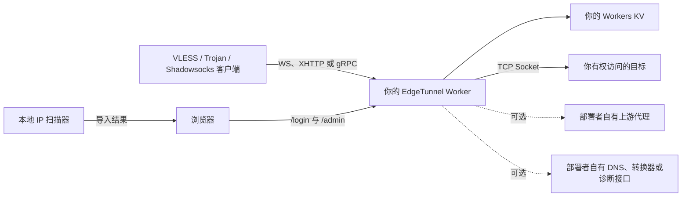

# Re_edgetunnel

<p align="center">
  自托管在 Cloudflare Workers 上的隧道服务，内置管理控制台、原生订阅与优选 IP 配置生成。
</p>

<p align="center">
  <a href="README.md">English</a> ·
  <a href="README.zh-CN.md">简体中文</a> ·
  <a href="README.es.md">Español</a> ·
  <a href="README.fa.md">فارسی</a>
</p>

<p align="center">
  
  
  
  
</p>

<p align="center">
  
</p>

Re_edgetunnel 是一个模块化 Cloudflare Worker：接收 VLESS 与 Trojan 的 WebSocket、XHTTP、gRPC 流量，以及通过 WebSocket 承载的 Shadowsocks SIP003 AEAD 流量，再使用 Cloudflare Socket API 建立出站 TCP 连接。同一个 Worker 还提供本地管理控制台，用来管理订阅、优选 IP、服务设置、访问日志、集成、备份和恢复。

控制台页面、样式、脚本、二维码生成器都随本仓库发布。运行时不会从第三方 GitHub 仓库、CDN 或公共面板拉取代码；可选集成在你主动配置之前保持关闭。

> [!IMPORTANT]
> 仅将本项目用于合法用途，以及你有权访问的系统和网络。Cloudflare 服务条款、当地法律、客户端配置和目标网络策略均由部署者负责。

## 先看结论

| 项目 | 当前能力 |
| --- | --- |
| 入站协议 | VLESS、Trojan、Shadowsocks SIP003 AEAD |
| 传输方式 | WebSocket、XHTTP `stream-one`、gRPC Hunk；Shadowsocks 使用 WebSocket |
| 出站方式 | 通过 `cloudflare:sockets` 建立 TCP，可直连或走部署者配置的上游代理 |
| 原生导出 | Mihomo/Clash YAML、分享链接，不依赖公共订阅转换服务 |
| 优选 IP | 导入本地扫描结果、保存到 KV，并生成带 `ip`、`port`、`name` 的可刷新订阅 URL |
| 管理功能 | 密码登录、KV 会话、概览、节点、设置、日志、集成、备份/恢复、退出登录 |
| 可选上游 | SOCKS5、HTTP CONNECT、HTTPS CONNECT、TURN/TURNS RFC 6062、SSTP |
| 不包含 | 本地运营商线路扫描器、原生 QUIC/UDP 入站、Hysteria2、TUIC、WireGuard、VLESS Reality |

## 整体结构



管理控制台和隧道数据面共用一个 Worker，但使用不同路由。打开 `/admin` 不会改变转发路径；使用优选 IP 只会改变客户端连接 Cloudflare 边缘时使用的地址，不会改变 Worker 的出站线路。

## 页面预览

下面的截图来自当前源码的本地运行实例。截图使用虚构 UUID 和 RFC 文档保留地址，不含生产域名、Cloudflare 账户信息、真实订阅 Token 或密码。

### 登录页

<p align="center">
  
</p>

### 优选 IP 库

<p align="center">
  
</p>

### 节点与订阅生成器

<p align="center">
  
</p>

## 部署前准备

需要以下条件：

- 已启用 Workers 的 Cloudflare 账户。
- 一个只给本次部署使用的 Workers KV 命名空间。
- 当前 Node.js LTS、npm 与 Git。
- 如需使用域名区域的 gRPC 能力，准备一个位于同一 Cloudflare 账户下的自定义域名。
- 可导入生成配置的客户端，例如 Mihomo/Clash。

项目使用了 `cloudflare:sockets`，因此目标运行环境是 Cloudflare Workers，不能直接作为 Vercel Function 或 Vercel Edge Function 使用。

## 从空白环境完整部署

### 1. 克隆与安装

```bash
git clone https://github.com/tianrking/Re_edgetunnel.git
cd Re_edgetunnel
npm ci
```

如果希望固定部署工具版本，可在项目里安装 Wrangler：

```bash
npm install --save-dev wrangler@latest
npx wrangler --version
```

### 2. 登录正确的 Cloudflare 账户

```bash
npx wrangler login
npx wrangler whoami
```

创建 KV 或部署前务必查看 `whoami`。这一步可以避免 Worker 被部署到另一个已登录账户。

### 3. 创建私有 Wrangler 配置

仓库中的 `wrangler.toml` 是公开模板。先复制为已被 Git 忽略的本地文件：

```bash
cp wrangler.toml wrangler.local.toml
# PowerShell: Copy-Item wrangler.toml wrangler.local.toml
```

可以在 `wrangler.local.toml` 中修改 Worker 的 `name`。不要提交这个本地文件。

### 4. 创建并绑定 KV

```bash
npx wrangler kv namespace create KV
```

Wrangler 会输出命名空间 ID。只在 `wrangler.local.toml` 中替换占位值：

```toml
[[kv_namespaces]]
binding = "KV"
id = "paste-your-kv-namespace-id-here"
```

绑定名称必须保持为 `KV`。测试与生产应使用不同命名空间；共用 KV 会同时共用设置、地址列表、日志和登录会话。

### 5. 检查并首次部署

```bash
npm run check
npm test
npx wrangler deploy --dry-run --config wrangler.local.toml
npx wrangler deploy --config wrangler.local.toml
```

尚未设置 `ADMIN` 时，普通 HTTP 请求会有意返回 `503 Administrator password is not configured.`。

### 6. 用 Cloudflare Secrets 保存两项凭据

在本地生成管理员密码和一个独立的 RFC 4122 v4 UUID：

```bash
node -e "console.log(require('node:crypto').randomBytes(32).toString('base64url'))"
node -e "console.log(require('node:crypto').randomUUID())"
```

在 Wrangler 的交互提示中输入，不要把值写进命令行或 TOML：

```bash
npx wrangler secret put ADMIN --config wrangler.local.toml
npx wrangler secret put UUID --config wrangler.local.toml
npx wrangler secret list --config wrangler.local.toml
```

- `ADMIN` 是 `/login` 的后台密码。
- `UUID` 是 VLESS 凭据，也是生成的 Trojan 与 Shadowsocks 节点所用密码。
- 订阅 `TOKEN` 不是后台密码，它由当前访问域名和 UUID 派生。

`ADMIN` 与 `UUID` 应使用不同值。更换 `ADMIN` 不会改变节点；更换 `UUID` 会让旧节点失效，并生成新的订阅 Token。

### 7. 添加自定义域名

只在 `wrangler.local.toml` 中添加：

```toml
routes = [
  { pattern = "tunnel.example.com", custom_domain = true }
]
```

重新部署：

```bash
npx wrangler deploy --config wrangler.local.toml
```

如果使用 gRPC，在 Cloudflare 域名区域的“网络”设置中启用 gRPC，并确保客户端 SNI/servername 仍是自定义域名。`workers.dev` 域名和自定义域名会得到不同的订阅 Token。

### 8. 登录后台

打开：

```text
https://tunnel.example.com/login
```

使用 `ADMIN` 登录。根路径默认显示仿 nginx 页面，这是正常行为。

## 第一次使用

### 生成原生 Clash 订阅

登录后：

1. 打开“节点与订阅”。
2. 不填写优选 IP 时使用 Worker 域名；也可以选中已经导入的本地扫描结果。
3. 生成节点预览。
4. 复制可刷新的订阅 URL，或下载 Mihomo/Clash YAML。
5. 导入客户端，并在实际网络中测试。

原生端点：

| 输出 | URL |
| --- | --- |
| 原始 URI 列表 | `/sub?token=TOKEN` |
| Base64 URI 订阅 | `/sub?token=TOKEN&base64` |
| Mihomo/Clash YAML | `/sub?token=TOKEN&format=clash` |
| 分享链接文本 | `/sub?token=TOKEN&format=links` |
| 使用优选地址的 Clash | `/sub?token=TOKEN&format=clash&ip=IP` |
| 强制下载 | 在 URL 后追加 `&download=1` |

优选 IP 相关参数：

| 参数 | 含义 |
| --- | --- |
| `ip` | 合法 IPv4 或 IPv6 连接地址 |
| `port` | 可选端口，范围 `1` 到 `65535`，默认 `443` |
| `name` | 可选节点名称，Worker 会限制长度并清理控制字符 |

订阅 URL 本身就是凭据。不要把它粘贴到公开 Issue、截图、统计服务或公共订阅转换站。

### 使用本地扫描出来的 Cloudflare IP

Worker 无法测量你当前运营商到 Cloudflare 的线路。扫描器必须运行在真正使用该节点的设备或网络中，然后把结果导入 `/admin`。

#### Windows：使用 CloudflareSpeedTest 做 HTTPing 延迟筛选

可以使用第三方开源工具 [XIU2/CloudflareSpeedTest](https://github.com/XIU2/CloudflareSpeedTest) 测试当前网络到 Cloudflare 边缘地址的 HTTP 延迟。Re_edgetunnel 不捆绑、托管或远程执行该扫描器；请从其[官方 Releases](https://github.com/XIU2/CloudflareSpeedTest/releases)下载与你系统架构匹配的版本。

在 `cfst.exe` 与 `ip.txt` 所在目录运行下面的 PowerShell 命令。把示例域名替换成你自己的 Worker 域名，只使用公开的 HTTPS 根地址；不要把订阅 Token、管理路径或其他凭据放进 `-url`。

```powershell
.\cfst.exe -f ip.txt -tp 443 -httping -url https://worker.example.com/ -n 50 -p 30 -dd -o result-httping.csv
```

| 参数 | 在本示例中的作用 |
| --- | --- |
| `-f ip.txt` | 从 `ip.txt` 读取待测 Cloudflare IP 或 CIDR 段 |
| `-tp 443` | 使用 HTTPS 常用的 `443` 端口 |
| `-httping` | 使用 `-url` 指定的 HTTP/HTTPS 请求测量延迟，而不是默认 TCPing |
| `-url https://worker.example.com/` | 使用你自己的 Worker 域名完成 TLS、HTTP 状态码和 Cloudflare 路由验证 |
| `-n 50` | 使用 50 个延迟测速线程；这是并发数，不是输出 IP 数量 |
| `-p 30` | 在终端显示排序后的前 30 条结果 |
| `-dd` | 禁用下载测速，结果按平均延迟排序 |
| `-o result-httping.csv` | 把完整结果写入当前目录的 CSV 文件 |

输出中的“可用”只表示 HTTPing 没有超时并返回了可接受的状态码，不表示这些 IP 全部适合作为节点。优先查看丢包率为 `0.00`、平均延迟较低并且多次复测稳定的结果。因为命令包含 `-dd`，下载速度列显示 `0.00 MB/s` 是预期行为，不是测速失败。

如果希望直接排除任何丢包，可以追加 `-tlr 0`；如果只想查看特定 Cloudflare 机房，可以追加类似 `-cfcolo SIN,HKG,NRT` 的过滤条件。HTTPing 也属于网络扫描，请保持适度并发，避免高频重复运行。测速时应关闭系统代理或确保 CFST 直连，否则测到的可能是代理线路。

`result-httping.csv` 是 CFST 的原始 CSV，当前控制台导入框接收的是每行一个地址的格式，而不是整份 CSV。挑选结果后按下面方式转换并粘贴到 `/admin` 的“优选 IP”页面：

```text
CFST CSV:    104.18.46.92,4,4,0.00,54.65,0.00,SIN
控制台格式: 104.18.46.92:443#SIN,54.65ms
```

上面的地址只用于说明字段转换，不代表它在其他运营商、地区或时间段仍然最优。导入后选择该地址生成 Clash 或分享链接，再用真实客户端复测连接、吞吐与晚高峰稳定性；一次 HTTPing 排名不能替代实际隧道测试。

支持的每行格式：

```text
IP
IP:端口
IP:端口#名称
IP:端口#名称,28ms
[IPv6]:端口#名称,42ms
```

仅用于文档的保留地址示例：

```text
198.51.100.42:443#Example-v4,28ms
[2001:db8::42]:443#Example-v6,42ms
```

使用 `ip` 参数时，只会修改生成节点的 `server` 和可选 `port`：

| 字段 | 处理方式 |
| --- | --- |
| `server` / 连接地址 | 替换为选中的 IP |
| TLS `servername` / SNI | 继续使用 Worker 域名 |
| WebSocket `Host` | 继续使用 Worker 域名 |
| XHTTP `host` | 继续使用 Worker 域名 |
| gRPC service name | 使用隧道路径去掉开头 `/` 后的值 |
| UUID、密码与路径 | 保持不变 |

如果把 `server`、SNI、Host 和路径全部改成 IP，Cloudflare 将无法正确识别目标 Worker。优选 IP 只是边缘连接地址，域名仍负责 TLS 与路由识别。

## 管理控制台

控制台会生成随机 256 位会话 Token，在 KV 中使用 SHA-256 派生键保存。Cookie 使用 `HttpOnly`、`Secure` 和 `SameSite=Strict`。会话 24 小时后过期；退出登录会立即撤销当前会话。

| 页面 | 作用 |
| --- | --- |
| 概览 | 查看协议/传输状态、域名、隧道路径、脱敏凭据、订阅请求数和优选 IP 数量 |
| 节点与订阅 | 生成 VLESS、Trojan、Shadowsocks 节点，本地绘制二维码，导出链接和 Clash YAML |
| 优选 IP | 导入、校验、去重、保存、选择和删除最多 128 个 IPv4/IPv6 结果 |
| 服务设置 | 修改订阅名称、路径、传输、指纹、刷新间隔、证书策略、0-RTT 和 Shadowsocks 设置 |
| 访问日志 | 查看 KV 日志；带凭据的查询参数在写入前会被移除 |
| 集成与诊断 | 查看显式配置的转换器、代理检测、用量 API、DNS、ECH、Telegram 与伪装站设置 |
| 安全 | 导出不含秘密的备份、恢复经过校验的设置、重置 UI 管理的默认值 |

主要管理路由：

| 路由 | 方法 | 作用 |
| --- | --- | --- |
| `/login` | GET、POST | 创建管理员会话 |
| `/admin` | GET | 加载自包含控制台 |
| `/admin/api/bootstrap` | GET | 返回已脱敏的控制台模型和原生导出信息 |
| `/admin/api/preview` | GET | 预览域名或指定优选 IP 的节点 |
| `/admin/api/settings` | POST | 保存 UI 管理的设置，同时保留无关配置 |
| `/admin/api/preferred-ips` | POST | 导入并保存本地扫描结果 |
| `/admin/api/backup` | GET | 导出设置和 IP，不包含 ADMIN、UUID、Token 或集成秘密 |
| `/admin/api/restore` | POST | 恢复经过校验的控制台备份 |
| `/admin/config.json` | GET、POST | 高级管理与旧配置结构兼容入口 |
| `/admin/ADD.txt` | GET、POST | 读取或替换部署者自己的地址列表 |
| `/admin/log.json` | GET | 读取访问日志 |
| `/admin/init` | POST | 重置 `config.json`，不会删除地址列表和日志 |
| `/admin/check` | GET | 检测显式配置的 SOCKS5/HTTP 上游 |
| `/logout` | GET | 撤销当前会话 |

所有修改配置的 POST 请求都要求同源 `Origin` 或 `Referer`，这是 CSRF 防护的一部分。

## 运行变量

敏感值放在 Cloudflare Secrets 中。必须因部署而异的非敏感值，可以放在已忽略的 `wrangler.local.toml`。

| 变量 | 推荐保存位置 | 用途 |
| --- | --- | --- |
| `ADMIN` | Secret，必需 | 后台管理员密码 |
| `UUID` | Secret，强烈建议 | 生成节点使用的标准 v4 UUID |
| `KEY` | Secret，可选 | 额外私有快捷路径与兼容密钥 |
| `HOST` | 普通变量，可选 | 覆盖生成配置中的域名列表 |
| `PATH` | 普通变量，可选 | 隧道路径，默认 `/tunnel` |
| `URL` | 普通变量，可选 | 根路径伪装：`nginx`、`1101` 或显式 HTTPS 源站 |
| `PROXYIP` | 普通变量或 Secret | 部署者选择的回退代理 IP |
| `UPSTREAM_PROXY` | 带凭据时使用 Secret | `socks5://`、`http://`、`https://`、`turn://`、`turns://` 或 `sstp://` 上游 |
| `TCP_CONCURRENT_DIAL` | 普通变量 | 直连竞速数量，限制为 `1` 到 `4` |
| `PROXY_CONCURRENT_DIAL` | 普通变量 | 代理候选竞速数量，限制为 `1` 到 `4` |
| `SPEEDTEST_MODE` | 普通变量 | `local` 返回有边界的本地 HTTP 204；`block` 关闭测速隧道 |
| `SPEEDTEST_DOMAINS` | 普通变量 | 由本地连通性测试逻辑处理的域名 |
| `DNS_RESOLVER` / `DNS_RESOLVER_PORT` | 普通变量 | 部署者自有 TCP DNS，用于受支持的 DNS 转发与 TURN/SSTP 解析 |
| `PROXY_CHECK_HOST` / `PORT` / `PATH` | 普通变量 | 代理诊断使用的部署者自有 HTTP 端点 |
| `LOCATIONS_API` | 普通变量 | 部署者自有 HTTPS 地理信息接口 |
| `ECH_DOH_URL` | 普通变量 | 仅在启用 ECH 时使用的显式 HTTPS DoH |
| `ALLOW_REMOTE_USAGE_API` | 普通变量 | 必须为 `true`，才允许调用保存在配置中的远程 Cloudflare 用量接口 |

为了兼容旧部署，代码仍识别 `PASSWORD`、`TOKEN` 等后台密码别名；新部署应统一使用 `ADMIN`。不要把凭据、Cloudflare 账户 ID、KV ID、私人域名或生成后的订阅 URL 写进受 Git 跟踪的文件。

## 可选订阅转换

原生 `format=clash` 和 `format=links` 永远不需要转换器。只有配置了你自己的 HTTPS 转换服务和配置 URL 后，才会启用旧式客户端格式请求：

| 请求 | 外部依赖 |
| --- | --- |
| `?clash` | 自有 `SUBAPI` 与 `SUBCONFIG` |
| `?singbox` | 自有 `SUBAPI` 与 `SUBCONFIG` |
| `?surge` | 自有 `SUBAPI` 与 `SUBCONFIG` |
| `?quanx` | 自有 `SUBAPI` 与 `SUBCONFIG` |
| `?loon` | 自有 `SUBAPI` 与 `SUBCONFIG` |

未配置时返回 HTTP 501，不会悄悄把订阅发送到公共服务。

## 可选的独立 Clash 订阅 Worker

`workers/clash-sub` 是独立部署的密码保护订阅 Worker，可为一个 EdgeTunnel 域名发布 Clash 配置。它有自己的通用 Wrangler 模板，并需要三个 Secrets：

- `SECRET_TOKEN`
- `PAGE_PASSWORD`
- `CLOUDFLARE_UUID`

同时需要设置 `CLOUDFLARE_HOST`，其中 UUID 必须与主 Worker 一致。完整说明见 [workers/clash-sub/README.zh-CN.md](workers/clash-sub/README.zh-CN.md)。不要把个人部署文件复制进仓库。

## 协议边界

支持：

- VLESS over WebSocket、XHTTP `stream-one`、gRPC Hunk。
- Trojan over WebSocket、Worker 路由上的 XHTTP、gRPC Hunk；原生 Clash 导出只生成客户端能安全描述的组合。
- Shadowsocks `aes-128-gcm` 与 `aes-256-gcm`，通过 WebSocket 使用 SIP003 AEAD 分帧。
- Cloudflare Socket API 可以访问的 TCP 目标。
- 配置部署者自有 TCP DNS 后的 VLESS/Trojan DNS。
- 作为上游路径的 SOCKS5、HTTP(S) CONNECT、TURN(S) RFC 6062 和 SSTP。

不支持：

- Hysteria2、TUIC：需要原生 QUIC/UDP。
- WireGuard 入站。
- VLESS Reality：TLS 已由 Cloudflare 终止。
- 任意 UDP 转发；当前 UDP 场景仅是显式配置的 VLESS/Trojan DNS。
- 原生 TCP 监听或通用 HTTP 正向代理。

TURN 范围限于 RFC 6062 TCP 分配与连接绑定。SSTP 范围限于 TLS、PPP PAP/IPCP、IPv4 与内部 TCP，不宣称支持 MPPE、IPv6CP 或厂商扩展。

## 安全与公开发布检查

每次公开提交前：

- 确保 `wrangler.local.toml`、`.dev.vars`、`.wrangler/` 未被跟踪。
- 使用 Secrets 保存 `ADMIN`、`UUID`、代理凭据、API Token 和独立订阅 Worker 凭据。
- 文档使用 `198.51.100.0/24`、`2001:db8::/32` 等保留示例地址。
- 截图来自虚构凭据的本地实例，不从生产后台直接截取。
- 同时检查当前文件和所有可访问 Git 历史；后续删除某个秘密，并不会把它从旧提交中移除。
- 任何曾经进入 Git 的凭据都应旋转，即使已经重写历史。

访问日志会在写入 KV 前移除常见的凭据查询参数。控制台备份不会包含 `ADMIN`、UUID、订阅 Token、会话和集成秘密。这些措施降低误泄露风险，但不代表订阅 URL 可以公开。

## 更新与回滚

```bash
git pull --ff-only
npm ci
npm run check
npm test
npx wrangler deploy --dry-run --config wrangler.local.toml
npx wrangler deploy --config wrangler.local.toml
```

查看版本并回滚：

```bash
npx wrangler versions list --config wrangler.local.toml
npx wrangler rollback --config wrangler.local.toml
```

修改存储设置前先从控制台导出备份。代码回滚不会自动回滚 KV 数据。

## 常见问题

### 根页面显示 “Welcome to nginx”

这是默认伪装页，请打开 `/login`。

### `503 Administrator password is not configured`

```bash
npx wrangler secret put ADMIN --config wrangler.local.toml
```

### KV 绑定错误

确认 ID 真实存在、绑定名正好是 `KV`，并确认 Wrangler 当前登录的是拥有该命名空间的账户。

### `403 Invalid Token`

从当前访问域名的控制台重新复制订阅。`workers.dev` 与自定义域名 Token 不同，更换 UUID 后 Token 也会变化。

### `/admin` 又跳回登录页

重新登录，检查 KV 绑定，并确认额外代理或浏览器扩展没有拦截 `/assets/edgetunnel-ui.css` 与 `/assets/edgetunnel-admin.js`。

### gRPC 无法连接

使用自定义域名，在 Cloudflare 域名区域开启 gRPC，并保持客户端 SNI/servername 为该域名。不要把 SNI 改成优选 IP。

### WebSocket 已连接但目标无响应

检查 UUID/密码、SNI、Host、路径、目标端口、Cloudflare 出站限制与 Worker 日志：

```bash
npx wrangler tail --config wrangler.local.toml
```

### 旧式订阅转换返回 501

配置自有 `SUBAPI` 与 `SUBCONFIG`，或直接使用原生 `format=clash` / `format=links`。

## 开发与测试

```bash
npm run check
npm test
```

针对专用 Cloudflare 测试环境的可选联调：

```bash
npm run test:cloudflare:http
npm run test:cloudflare
```

不要用生产凭据和生产 KV 运行外部协议测试。

目录结构：

```text
src/
├── index.js                  Worker 入口与路由分发
├── config.js                 配置、KV、派生链接与日志
├── controllers/              登录、管理 API 与订阅
├── core/                     Socket 生命周期、拨号、HTTP 隧道与测速处理
├── protocols/                协议解析与上游适配
├── subscriptions/native.js  原生 Clash/分享链接与优选 IP 替换
├── ui/                       自托管页面、样式、脚本与二维码
└── utils/                    输入解析、安全检查、页面与诊断

workers/clash-sub/            可选的独立 Clash 订阅 Worker
test/                         Node 测试套件
scripts/                      专用 Cloudflare 环境验证脚本
docs/images/                  已脱敏的文档截图
```

## 致谢

Re_edgetunnel 参考了 [cmliu/edgetunnel](https://github.com/cmliu/edgetunnel) 与 [zizifn/edgetunnel](https://github.com/zizifn/edgetunnel) 的社区实践。本仓库维护的代码已经模块化，运行时不会拉取这两个上游仓库。

## 许可证

见 [LICENSE](LICENSE)。项目不提供任何担保；部署安全、合法使用以及 Worker 处理的流量均由部署者负责。
